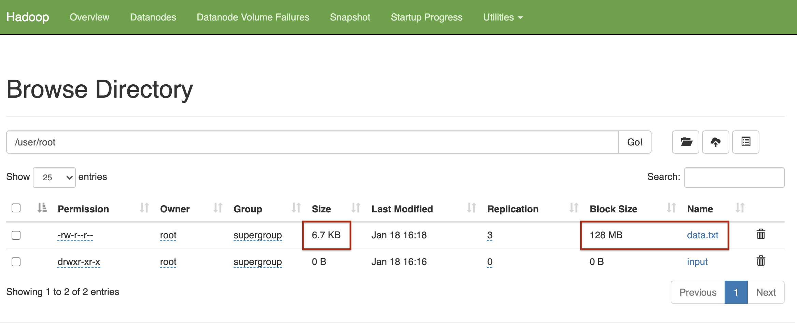

# Big Data with Spark & Hadoop

Notes from videos/labs. Mostly in Turkish.

## Content

1. [Week 1 - Introduction](#week-1---introduction)
2. [Week 2 - Hadoop](#week-2---hadoop)
3. [Week 3 - Spark](#week-3---spark)
4. [Week 4 - DataFrames & SparkSQL](#week-4---dataframes--sparksql)
5. [Week 5 - Spark Architecture](#week-5---spark-architecture)
6. [Week 5 - Spark Runtime Environments](#week-5---spark-runtime-environments)
7. [Week 6 - Monitoring & Tuning](#week-6---monitoring--tuning)

## Week 1 - Introduction

1. [What is Big Data](#big-data-nedir)
2. [5V of Big Data](#5-v-of-big-data)
3. [Impact of Big Data](#impact-of-big-data)
4. [Parallel Processiong & Scalability](#parallel-processing--scalability)
5. [Tools and Ecosystem](#tools-and-ecosystem)
6. [Open Source and Big Data](#beyond-the-hype)
7. [Beyond the Hype](#beyond-the-hype)

### Big Data Nedir

* Veri buyuklugu normal verilere gore buyuk. 
* Structured, semi-structured veya unstuctured olabilir.
* Inceleyebilmek icin process edilmesi gerekli.
* Farkli kaynaklardan surekli olarak akis halinde gelir.
* Videolar, ses, resim gibi turlerde de olabilir.
* Daginik sistemlerde islenirler.

Su akisa gore ilerlenir:

1. Data Collection (Hadoop Hdfs)
2. Data Modelling (Hadoop Yarn / MapReduce)
3. Data Processing (Spark, Hive)
4. Data Visualization

### 5 V of Big Data

* Velocity: Hizli islenme, durmadan islenme. Batch, gercek zamana yakin ve streaming olarak islenebilir.
* Volume: Datanin miktari. Surekli artiyor.
* Variety: Veri makinalardan, insanlardan ve islemlerden gelebilir. Structured, semi str. veya unstr. olabilir.
* Veracity: Veri kalitesi, kaynagi ve tutarliligiyla ilgilidir. Insanlardan ve islemlerden gelen veriyle ilgilidir.
* Value: Hepsinden alinabilecek value.

### Impact of Big Data

Alisveris sitelerinde, kisisel asistanlarda sikca kullanilir. Amazon, Siri, Google Now gibi gibi.

IoT cok data uretiyor bu konuda.

### Parallel Processing & Scalability

Parallel processing:
Veri buyuk oldugu icin klasik bilgisayar metodu kullanilamiyor. Veriyi diskten al, memory'e, isle, geri yukle yapamiyorsun boyuttan oturu.

Veriyle yapilacak tum islemleri farkli konumlarda cozmeye calisiyorsun, boylece hata durumunda ayni node icinde o islem tekrar yapiliyor. 

Data Scaling nedir?

Verinin boyutuna gore memory'i veya bilgisayari buyuttugunu dusun. OKey ama Big Data icin no no.

Onun yerine Horizontal Scale yapiyosun, embarrasingly parallel yapacaksin. Bisuru node veya cluster olacak veriyi paylastirabilecek.

Bunda da soyle durumlar oluyor: Veriyi siralayacaksin mesela buyukten kucuge. Node'lar birbiriyle iletisime gece gece tek makina gibi hareket etmek zorunda kalacak.

O yuzden, boyle toplu islemleri yapmak icin bi node'un olacak. Verinin ilgili kisimlarini burada tutacaksin tek parca. Verinin kopyalarini da node'lara dagitacaksin.

### Tools and Ecosystem

- [Data Tech](#data-tech)
- [Analytics and Visualization](#analytics-and-visualization)
- [Business Intelligence](#business-intelligence)
- [Cloud Providers](#cloud)
- [NoSql Dbs](#nosql-databases)
- [Programming Tools](#programming-tools)

#### Data Tech

- Hadoop
- HDFS
- Spark
- MapReduce
- Cloudera
- DataBricks

#### Analytics and Visualization

- Tableau
- Palantir
- SAS
- Pentaho
- Teradata

#### Business Intelligence

Raw Data'yi kullanilabilir hale getirir, analize uygun hale getirir. Istatistik gibi alanlari kullanabilir.

- Cognos
- Oracle
- Power BI
- Business Objects
- Hyperion

#### Cloud

- AWS
- IBM
- Google Cloud
- Oracle

#### NoSQL Databases

- MongoDB
- CouchDB
- Cassandra
- Redis

#### Programming Tools

- R
- Python
- SQL
- Scala
- Julia

### Open Source and Big Data

Projelerin gelistirilmesi ve surdurulmesi icin kacinilmaz. 

Commiter: Kodu dogrudan degistirebilenler.
Contributer: Degisiklikleri review icin gonderen destekciler.
User: Kullanicilar.

Hadoop kritik bi Big Data teknolojisi. Hadoop'taki su projeler mesela onemli open source:

- MapReduce, Spark'in muadili
- Hadoop File System, Dataset manager gibi
- Yet Another Resource Negatioator (YARN), Resource Manager. Kubernetes gibi muadilleri var.

Hive ve Spark, ETL islerini filan destekliyor hep.

### Beyond the Hype

Big Data Kaynaklari:

- Social Data
- Machine Data (IoT vs.)
- Transactional Data

**Structured Data:**

Organized, labeled ve tablo seklinde formati var.

Sql direkt bir ornek.

**Unstructured data:**

Image'lar, sensor datasi, text data vs. vs.

Sosyal medya icerikleri filan buralardaymis. Videolar vs.

**Semi Structured**

E postalar mesela. Hem structured alanlar var hem de karisik alanlar.

Xml veya Json dosyalari da buraya giriyor

Cloud computing'in ilerlemesi de big datayi hizlandirmis.

### Use Cases

Finans, teknoloji ve telekomunikasyon'da cok kullanim var. Retail, government ve healthcare devam ediyor.

**Retail'de** mesela:

- Price Analytics
- Sentiment Analystics: Urunler hakkindaki yorumlardan cikarim yapar

 **Insurance:**

- Fraud Analytics
- Risk Assessment: user history'e gore modelleme yapilabilir.

**Telecommunications:**

- Network Security
- Location Bases Promotions
- Real time network analytics
- Pricing promotions

**Manufacturing:**

- Predictive Maintenance
- Production Optimization

**Automative:**

- Predictive Support: bunun arabasi bozulacak arayalim bi
- Connected self-driven cars

**Finance:**

- CUstomer Segmentation
- Algoritmic Trading

## Week 2 - Hadoop

1. [Introduction](#hadoop-introduction)
2. [MapReduce](#mapreduce)
3. [Hadoop Ecosystem](#hadoop-ecosystem)
4. [HDFS](#hdfs)
5. [HIVE](#hive)
6. [HBase](#hbase)
7. [Hadoop and MapReduce Lab Example](#hadoop--mapreduce-lab-example)
8. [Hadoop Cluster Lab Example](#hadoop-cluster-example-lab)

### Hadoop Introduction

Big data teknolojisi.
Buyuk miktarda data, farkli farkli kaynaklardan gelen data ve structured & unstr. data icin ideal. Cluster'larda paralel calisabilir.

Bir DB Degil, data isleme ortami gibi.

* HDFS : Storage module. 
* MapReduce: Processing unit.
* YARN: Resource manager.

Kotu yanlari:

- Transaction processing
- Parallel degil de lineer isler
- Datada dependency varsa
- Low latency data access
- Cok sayida kucuk dosya varsa (MapReduce'un bazi ozellikleri bunun icin gelistirildi)
- Little data uzerinde Intensive calculations (Hive daha iyi)

### MapReduce

Big Data isleyicisi. Hadoop'un kalbi. Distrubuted computing saglar. Map ve Reduce tasklarindan olusur (tabi ki).

Map: Input file alir (hdfs'ten mesela), bilgileri key-value listesi olarak map halinde saklar. Bikac islem daha yapar.

Reducer'a iletilir. Reduce de paralel sekilde derliyor topluyor isliyor.

**Isleyisi:**

'isimler' datasinda kac tane ozgun isim oldugunu bulan akis:


**Neden MapReduce Kullanalim?**

- Parallel Computing saglar node'lar arasinda. Name ve Data Node'lari olur Hadoop'ta
- Splitting and running tasks in parallel

**Use Case'ler**

- Sosyal medya uygulamalari
- Recommendations data
- Financial Industries
- Advertisements (cok severiz malum)

### Hadoop Ecosystem

Hadoop Common - Common utilities and other modules. Orn:

- HDFS
- MapReduce
- YARN


**Ingesting:**

- Flume: Big Data toplar ve iletir. Basit ve esnek bir mimarisi vardir
- Sqoop: Relational Db datasi toplar ve hadoop'a iletir. Ayrica ilgili MapReduce kodlarini da olusturup uretiyormus. Hdfs islerini de hallediyor sanirim(?). Db accessi oldugu icin schema'lari anliyor.

**Store data:**

- HBase: Column based sekilde non-relational databasedir. Hdfs uzerinde calisir. Datayi hashmapler, yani indexler, halinde saklayip random access-faster access saglar.
- Cassandra: Bir NoSQL db'dir.

**Analyzing data:**

- Pig: Large data analyzer. Prosedurel data flow language'i var.
- Hive: Report creating. Server side calisir. Kullanici erismek istedigi datayi secer: declerative'dir.

**Access data:**

- Impala: Non-tech userlarin kullanimini saglar.
- Hue: Hadoop User Experience'in kisaltmasi. Data upload, browse ve query islemleri saglar. Pig islerini ve akislarini calistirabilir. Hive ve MySql icin SQL query destegi saglar.

### HDFS

Buyuk datayi bloklar halinde replike ederek saklar. Fault tolerant da oluyormus boylece. Scale etmesi de kolay ve ucuz.

Streaming data access'i sunuyormus.

Ayrica bir CLI sunuyormus interaksiyon icin.

**Blocklar** calisiyor. 64 mb veya 128 mb chunklar halinde tutuyor blocklari. Daha az kalirsa bi bloga, daha az olabilir tabi.

Block is a minumum size of a file (dolmayabilir)

**Nodes**

Calisan her bi makina gibi dusunelim. Primary ve Secondary Node'lar var.

- **Primary Node:** aka. Name Node. File access'i duzenler. Secondary node'un tasklarini yonetir. Her CLUSTER'da 1 tane.

- **Secondary Node:** aka. Data Node. Read Write requestlerini gerceklestirir. Cokca olabilir.

Primary node, is ustlendigi zaman kendisine en yakin rack'leri onceliklendirir. Maximizing efficiency.

**Racks**

Rack: 40 veya 50 adet, ayni networku kullanan node toplulugu

Rack awareness calisiyor Hadoop. Onceliklendirme yaptigi gibi, ayrica replikasyon yapilan rack'leri de farkli tutuyor ki fault proof devam.

**Boyuta gore siralama:**

Blocks -> Nodes -> Racks -> Cluster

**Replication demisken:**

Backup amaclidir. Replication factor: Bir block'un kac kere replike edilecegi.

#### Write once, read many times

HDFS'in dosya konsepti. Editing updatingden ziyade append usulu.

**Read** icin: Client datanin oldugu node'u bulmak icin istek atar. Read requestini ilgili node'a atar(?). Close connection.

**Write** icin: Yazdirilmak istenen file var mi diye bakilir. Varsa IO Exception. Yoksa yetkilendirilir. Yazma islemi, replikalarin yazilmasiyla sonlanir.

### HIVE

Structured/Tabular data icin **warehouse software**. Read/write/manage islerini yapabiliyor. SQL gibi HiveQL'i var. Cleansing ve filtering destekliyor

**RDBMS'le kiyaslanisi:**


**Mimarisi:**


- JDBC/ODBC Client: Java applerini / ODBC applerini Hive'a baglayan clientlar.

- Hive Services:
    - Hive Server: Enabling Queries
    - Driver: Recieves query statements
    - Optimizer: Tasklari boler
    - Executor: Optimizer'dan aldigi tasklari calistirir
    - Metastore: Metadata storage

### HBase

Column base non-relational **bir database.** HDFS uzerinde calisir. Real time data ve random read/write access of Big Data islerinde iyiymis.

**Features:**

- Linearly & modularly scalable
- MapReduce isleri icin bir backup support
- Consistent reads and writes
- No fixed column schema
- Kullanici erisimi icin kolay bir Java API'i
- *Cluster'lar arasi* data replikasyonu da saglar

Column diyoruz da bildigin column iste. Ama kolonlari tek tek degil, bazilarini column family olarak grupluyor. Family'lere sonradan kolon eklenebiliyor. 

HBase'in de primary node / region server olarak iki nodu cesidi var.

**HBase ve HDFS Kiyaslamasi**

HBase dinamik degisikliklere izin veriyor, burasi onemli. Sadece write/read degil.


#### HBase Mimarisi:


- HMaster: Master Server.
    - Region serverlari monitor eder
    - Region serverlara region atar
    - Schemalara yapilan degisiklikleri yonetir
- Region Servers:
    - Read Write requestleri alir.
    - Regionlari yonetirler
    - Client ile direkt kontakt kurabilir.
- Region:
    - En kucuk HBase cluster birimi
    - Contains multiple stores. Her column family icin bir store.
    - HFile ve MemStore diye iki componenti varmis :(
- Zookeeper:
    - Node'lar arasi baglari maintain eder (hdfs diye nodelar var)
    - Daginiklikta senkronizasyon saglar
    - Server failure'lari tespit eder, islemleri yapar.

### Hadoop & MapReduce Lab Example

*Bu ve sonraki lablarda, 
hadoop ortamini windows'ta kurmakta sorunlar yasadim.
labaratuvar uzerinden ilerledim sadece*

Indirilen dosyalari, onceden olusturulmus bir 'wordCounter' mapReduce ile calistirdik.
Sonuc olarak bize bi *_SUCCESS* dosyasi, bi de *part-r-00000* dosyasi olustu.
Part-r olanda word count vardi.

Su komut ile programi calistirdik:

```sh
bin/hadoop jar share/hadoop/mapreduce/hadoop-mapreduce-examples-3.2.3.jar wordcount data.txt output
```

Ornegin calisma akisi su sekilde:


### Hadoop Cluster Example Lab

Dockerize hadoop kullanip hadoop Cluster yaratacagiz.

Indirilen git reposunda su komutla docker calistirildi:

```sh
docker-compose up -d
```

Docker-compose, bi YAML dosyasi icindeki servisleri olusturup calistirir.
Calistirinca soyle oldu:

```
 ⠿ Network ooxwv-docker_hadoop_default                Created   0.2s
 ⠿ Volume "ooxwv-docker_hadoop_hadoop_namenode"       Created   0.0s
 ⠿ Volume "ooxwv-docker_hadoop_hadoop_datanode"       Created   0.0s
 ⠿ Volume "ooxwv-docker_hadoop_hadoop_historyserver"  Created   0.0s
 ⠿ Container namenode                                 Started   5.3s
 ⠿ Container resourcemanager                          Started   3.0s
 ⠿ Container nodemanager                              Started   4.4s
 ⠿ Container datanode                                 Started   5.3s
 ⠿ Container historyserver                            Started   3.5s
 ```

Sonra asagidaki komutla nameNode'u calistirmisiz:

```
docker exec -it namenode /bin/bash
```

Hadoop'u kullanmak icin config dosyalari editleniyor. Bu dosyalardan bazisi:

- hadoop-env.sh: Masterfile. Yarn, hdfs, mapreduce ve hadoop ayarlarini ayarlar.
- core-site.xml: Hdfs ve Hadoop core ozelliklerini ayarlar.
- hdfs-site.xml: Node metadatasinin lokasyonunu, fsimage dosyasini ve log dosyasini kontrol eder.
- mapred-site.xml: MapReduce config parametreleri
- yarn-site.xml: Yarn ayarlari. Node manager, resource manager, containerlar ve Application master ayarlari vardir.

Hdfs icinde bir **directory yarattik**:

    hdfs dfs -mkdir -p /user/root/input

Hadoop config xml dosyalarini input klasorune kopyaladik:

    hdfs dfs -put $HADOOP_HOME/etc/hadoop/*.xml /user/root/input

data.txt dosyasi cektik internetten. Onu da */user/root* a kopyaladik:

    hdfs dfs -put data.txt /user/root/

*cat* ile dosya icerigine baktik, kopyaladigimizi teyit ettik:

    hdfs dfs -cat /user/root/data.txt

Bu noktada, calisan hadoop uygulamasina girecektik.
Ama kurstaki uygulama icinden calistiramadim aplikasyonu.
Gorsellere bakarak devam ediyorum.

Utilities -> Browse file system ile ilerlendiginde,
az once yarattigimiz dosyalari gorebiliyoruz.
data.txt dosyasini ve block sizelerini da goruyoruz:



Dosyaya tikladigimizda, block id'sini filan da gorebiliyoruz.

**Notlar:**

- Name Node, sakladigi dosyalarin metadatasini memory'de tutar. 
Quick access icin.
- Hadoop cluster'imizda sunlar olacak:
    - Name node
    - Data node
    - Node manager
    - Resource manager
    - Hadoop History Server

## Week 3 - Spark

1. [Introduction](#introduction-to-spark)
2. [Functional Programming Basics](#functional-programming-basics)
3. [Parallel Programming Using RDD](#parallel-programming-using-rdd)
4. [Parallelism in Spark and Scaling Out](#sparkta-parallelism-ve-scaling-out)
5. [SparkSQL and DataFrames](#sparksql-ve-dataframes)
6. [Spark Lab Example](#spark-labaratuvar)
7. [Spark Highlights](#week-3-spark-highlights)

### Introduction to Spark

Onemli ozellikler:

- Open source
- In-memory
- Distributed data processing
- Iterative analysis on Massive data
- Genelde Scala'da yazilir. Scala JVM'de calisir.

**Distributed != Parallel**

- Parallel: Farkli processorler, ayni memory
- Distributed: Processorlerin kendi memoryleri olabilir, daginik memoryler olabilir.

**Distributed'in faydalari:**

- Scalability ve modular growth
- Fault tolerance and redundancy

**MapReduce'a kiyaslanisi:**

MapReduce isinde diske veya HDFS'e yapilan read'ler write'lar olurdu.

Spark bunu gerekli datayi in-memory yaparak cozuyor.
Disk IO'lari expensive ve time consuming imis.

Data Engineering icin kullanilan Spark urunleri:

- Core Spark Engine
- Clusters and executors
- Cluster Management
- SparkSQL
- Catalyst Tungsten DataFrames

### Functional Programming Basics

- Matematiksel fonksyonlari temel alir
- Declarative model izler
- 'Nasil' odakli degil de 'ne' odaklidir. Input ve output odaklidir.
- Statementlar yerine expressionlar kullanir

Ayrica tasklarimizi node node ayirip parallelization da yapabiliriz(?).
Spark, inheritly parallel.

### Parallel Programming using RDD

**RDD:** Resillient Distributed Datasets.

- Spark'in temel data abstraction metodu.
- Fault tolerant collection of elements.
- Cluster icindeki node'lara partition'lanir.
- Parallel operasyonlari calistirabilir.
- **Immutable'dir**. Olustuktan sonra degistirilemez. Degistirilmesi teklif dahi edilemez.

Spark'ta bir 'driver program' calisir. 
Kullanicinin temel islemlerini gerceklestirir.
Parallel operasyonlari da cluster'lara uygular.

RDD supports file types:

- Text
- SequenceFiles
- Avro
- Parquet
- Hadoop input formats

RDD Supports file formats:

- Local
- Cassandra
- HBase
- HDFS
- Amazon S3
- SQL and NoSql

**RDD Olusturma**

External veya local file'i, Hadoop-Supported systemlerden alip olusturabiliriz.

HDFS, Hbase, S3 veya Cassandra RDD yaratimi icin yardimci olabilir.

**VEYA**

Kodumuzdaki collection'lardan da basitce olusturabiliriz.

```scala
val data = Array(1,2,3,4,5)
val distData = sc.parallelize(data)
```

Aha da RDD olusturduk driver-programdeki listeden. Python veya java'dan da yapabilirdik.

Dosyayi RDD'lestirmek konusunda, partitioning giriyor isin icine.
Kac partition olacak? Spark her partition icin 1 task calistirir.

Her CPU'ya 4 5 partition genelde okey.
Spark cluster'a gore otomatik sayida partition olusturur.
Biz manuel de verebiliriz.

**VEYA**

Mevcut bir RDD'yi modifiye edip de yeni bir RDD olusturabiliriz (cunku immutable)

#### Parallel Programming:

Cok sayida islem gucunun es zamanli kullanilip, computational problem cozmesi. Distributed gibi.

Runs simultaneous instructions on multiple processors.

Memory shared olarak kullanilir, distributed'den farkli olarak.

Control/coordination mekanizmasi kurar.

**RDD ile iliskisi**

RDD olustururken partitioning ile bolmustuk datayi.
Her partition worker'larda memory'de tutulur. 
Spark, cluster'daki *her partition icin bir task calistirir*.

**Nasil Resillience sagliyor?**

- Immutable oluslari **always recoverable** yapiyor datayi.
- **Persist & Cache** islemleri ile memory'de iterative isleri hizlandirir ve fault-tolerance saglar. (?)

### Spark'ta parallelism ve Scaling out

Spark'in 3 temel componenti:

- Data Storage: HDFS veya baska formatlar.
- Compute Interface: API'lar: Scala/Java/Python
- Management: Distributed isleri yonetir. Clusterlari filan. Mesos, YARN, Kubernetes vs.

**Spark Core:**

Base engine'dir. Ozellikleri:

- Fault tolerant
- Large scale parallel ve distributed data processing
- Manages memory
- Schedules tasks
- Houses API's that defines RDD's
- Contains distributed collection of elements that are oarakkekized across the cluster

**Spark'in nasil scale oldugu** de soyle aciklanmis:

- Driver Node
- Executor Node

Bu iki node arasinda patron/calisan iliskisi var.

Driver node tasklari yonetip distributed olarak pay eder.
Executor'de de *Worker Node*lar bu pay edilmis isleri ustlenip sonuclari geri Driver'a iletirler. Resimli olarak:


Bu Worker Node'lari artir dur istedigin kadar. Spark is gucu olarak onlara dagitsin isleri. Bu sayede big dataya scale ediliyor.

### SparkSQL ve DataFrames


#### SparkSQL

- **Structured** data processing modulu.
- Query icin SQL veya baska DataFrame API'lari kullanabilir.
- Java, Scala, Python ve R'da kullanilabilir.
- Kullanilan programlama dilinden veya API'lardan *bagimsiz* olarak SQL querylerini import edilen data uzerinde veya RDD uzerinde calistirir.

```py
results = spark.sql(
    "SELECT * FROM people")
# people'i onceki satirlarda register etmen gerekiyormus
names = results.map(lambda p: p.name)
```

**SparkSQL Faydalari**

- Cost-based optimizer'i, columnar storage'i, code generation'u var.
Bunlar fast query times demek.
- Spark Engine ile buyuk sayilara scale ettigi icin fault-tolerance.
- DataFrame abstractionunu sunar. Ayrica distributed SQL query engine olarak da calisir.

#### DataFrames

Python DataFrame'ine benziyor ama zengin optimizasyonlusu. Aslinda RDBMS Tablolarina benziyor.

RDD API'si uzerine kurulmustur. RDD'leri relational query atabilmek icin kullanir.

Python uzerinde json -> DataFrame olusturulmasi:

```py
df = spark.red.json('people.json')
df.show()
df.printSchema()

# Register the dataframe as temp SQL view.
df.createTempView('people')
# Artik tablo gibi kullanabiliriz people'i.
```

- DF'ler epey scalable'dir.
- Cokca data formatina ve storage system'e destegi var
- Optimizasyonu ve code generation'u gucludur (SQL Catalyst optimizer)
- Big data toollari ve infrastructure'lari ile Spark sayesinde erisilebilir.
- Python, Java, Scala ve R'da API'lari mevcut.

**DataFrame kullanimiyla SparkSQL'i kiyaslayalim:**

SparkSQL:

```py
spark.sql("SELECT age, name FROM people WHERE age > 21").show()
```

DataFrame Python API

```py
df.filter(df["age"]>21).show()
```

Ikisi de tablo olarak sonuc dondurecektir.

### Spark Labaratuvar

Spark normalde Scala uzerinde yazilmis. 
Python'dan PySpark kullanabiliriz tabi, ama bu python'un JVM'e erismesi demek.
JVM'e git geller kodu yavaslatabiliyor.
Buna istisna olarak SparkSQL'i gosterebiliriz, cunku query'leri precompile ediyor. Execution planning engine'i guclu.

Bu PySpark yavasligini minimuma indirgemek icin:

- 'Out of the box' metotlari agirlikli kullanmak lazimmis. Ne demekse...
- Spark metotlarina iterative/frequent call spamlamamak lazim.

Performans isteyen Scala'ya gitsin.

---

SparkContext ve SparkSession yaratilacak.
Sonrasinda RDD olusturulacak ve temel aksiyonlar denenecek.

**SparkContext**, Spark'in giris noktasidir. RDD yaratimi icin kullanilan fonksyonlari icerir. **parallelize()** gibi.

**SparkSession**, SparkSQL ve DataFrame operasyonlari icin gereklidir.

Session'u baslattiktan sonra sira RDD'lerde.
**RDD**ler Spark'in ilkel data soyutlama bicimidir. Fonksyonel programlamadan konseptler kullanarak olusturup manipule edecegiz.

Lab'da **parallelize()** kullanarak RDD olusturuluyor.

#### Lazy Evaluation & Transformations

RDD'ler Immutable demistik. Bu yuzden RDD'lerde islem yapacaksan (map, filter gibi) yeni RDD'ler olusturarak yapiyorsun.

Spark, bu transformation'lari RDD olustururken yapmiyor. 
RDD'ye ilistiriyor bu islemleri. Sen sonuclari cagiracak oldugunda aksiyonlar aliniyor. Sonuclari Driver'a cagirip doner.
Buna **Lazy Evaluation** denir.

Transformation'u cagirmak icin **collect()** cagrilir.

#### Caching

Bi RDD'yi **.cache()** ile cache'lersen, onda yapacagi ilk islemde cache'e de aktarim yapar.
Ayni islemi tekrar cagiracak ol mesela, hopp artik kisa surede yapacak.

#### DataFrames ve SparkSQL

SparkSQL'le calisabilmek icin Spark Session gerekli. Labin basinda kontrol ettik hemen.

**read.json()** ile basitce DF'e aktarabiliriz json dosyalayini.

DataFrame'leri SQL icin temp view'lara donusturebiliriz.
Bu sayede query icinde *FROM* alanina ekleyebiliriz.

Kodda SQL queryleri ile de sonuclari cekebiliriz,
DataFrame'in kendi metotlarini da kullanabiliriz.

#### Orneklere notlar:

**Q2 -** TempView yarattim soru icin. 
Ama komutu tekrar calistiracagimda ayni tempView mevcut diye hata veriyor.

Silip tekrar yukleyebilmek icin: **spark.catalog.dropTempView(...)** metodunu cagirdim.

**Q3 -** Spark Session'u kapatmamizi istemis.

Spark Session'larini hep kapatmak lazim best practice icin.
Resource paylastirma isleri icin lazim genelde.

Pekiii, **context'i kapatmali miyiz?**

Gerekli  degil. Yenisini yaratacaksan kapatman lazim mevcut olani. Onun disinda kalsin.

**SparkContext ile SparkSession farklari nedir?**

Aslinda ilk SparkContext yaratiliyor. Sonra SparkSession olusturuldugunda pek cok utility buraya aliniyor.

Su an, RDD yaratimi icin **SparkContext** (variable'i genelde **sc**),

Kalan islere de **SparkSession** (variable'i genelde **spark**) kullandim gibi.

### Week 3 Spark Highlights

Spark is an open source in-memory application framework for distributed data processing and iterative analysis on massive data volumes​. Both distributed systems and Apache Spark are inherently scalable and fault tolerant. ​Apache Spark solves the problems encountered with MapReduce by keeping a substantial portion of the data required in-memory, avoiding expensive and time-consuming disk I/O.​

Functional programming follows a declarative programming model that emphasizes “what” instead of “how to” and uses expressions.​

Lambda functions or operators are anonymous functions that enable functional programming​. Spark parallelizes computations using the lambda calculus​ and all functional Spark programs are inherently parallel​.

Resilient distributed datasets, or RDDs, are Spark’s primary data abstraction​ consisting of a fault-tolerant collection of elements partitioned across the nodes of the cluster, ​capable of accepting parallel operations​.​You can create an RDD using an external or local Hadoop-supported file, from a collection, or from another RDD. RDDs are immutable and always recoverable, providing resilience in Apache Spark​ RDDs can persist or cache datasets in memory across operations, which speeds iterative operations​ in Spark.

Apache Spark architecture consists of components data, compute input, and management​. The fault-tolerant Spark Core base engine performs large-scale Big Data worthy parallel and distributed data processing jobs, manages memory, schedules tasks, and houses APIs that define RDDs​.

Spark SQL provides a programming abstraction called DataFrames and can also act as a distributed SQL query engine​. Spark DataFrames are conceptually equivalent to a table in a relational database or a data frame in R/Python, but with richer optimizations​.

## Week 4 - DataFrames & SparkSQL

1. [RDD's in Parallel Programming and Spark](#rdds-in-parallel-programming-and-spark)
2. [SparkSQL & Catalyst & Tungsten](#sparksql--catalyst--tungsten)
3. [ETL with DataFrames](#etl-with-dataframes)
4. [DataFrames Lab](#dataframes-lab)
5. [Spark SQL Real World Usage](#real-world-usage-for-spark-sql)

### RDD's in Parallel Programming and Spark

Primary Data Abstractionumuzdu. 
Node'lara partitionlanir.

#### Transformations

- Aslinda eski RDD'den yenisini olusturarak yapilir.
- Lazy evaluation vardir, action olmadikca computation olmaz.

**Actionlar**

Driver programa transformation sonuclarını donen islemlerdir.
Ornek:

```py
.reduce()
.collect()
```

RDD'lerin Transformation'lari islemesini **Directed Acyclic Graph (DAG)** semasina bagliyorlar.

**DAG:**

- Grafiksel data structure. Kenarlar ve koseler var.
- Her yeni kenar eski bi koseden olusturulur
- Koseler: RDD'leri
- Kenarlar: Operasyonlari temsil eder.
- Fault tolerance sagladigi icin kullanilir. Node'lardan biri giderse, Spark bu DAG'i replike eder ve node'u kurtarir.

**Akis semasi**

1. RDD yaratilirken Spark DAG de yaratir.
2. Spark DAG Schedular'i acar, transformation'u yapip DAG'i gunceller.
3. DAG artik yeni bir RDD'yi isaret ediyor.
4. RDD'yi transform eden pointer Spark Driver Program'a doner.
5. Action olursa, aksiyonu cagiran Driver program sadece aksiyon bittiginde DAG'i isler.

**Transformation Examples**

- **map()** her elementi verilen fonksyondan gecirip yeni bir distributed dataset olusturur.
- **filter()** selection kosuluna uyan yeni bir dataset doner
- **distinct()** Distinct elementlerden olusan yeni bir dataset doner
- **flatmap()** her input elemanini sifir veya daha fazla output elemanina map'leyebilir. icine pasladigimiz fonksyon tek bir item yerine **Seq** donmelidir.

**Action Examples**

- **reduce()** icine paslanan *func*a gore aggregate eder.
- **take()** ilk *n* elemani return eder. (n:input)
- **collect()** Tum elemanlari array olarak doner.
    - Make sure that ? will fit in driver program
- **takeOrdered()** N kadar elemani ya asc sirali doner ya da icine pasladigin fonksyona gore dondurur.

**Akis Gorseli**


### DataFrames and DataSets

#### DataSets

Spark'in data abstractionlarindan en yenisi.
Distributed data icin API saglar, RDD ve DataFrame gibi.
**Strongly typed jvm objeleri**dir.
Yani, **type-safe**dir. Olusturulurken datatype'i atanir.
Bu sebeple sadece Java ve Scala icinden API'i cagrilabilir.
Python gibi dillerin dynamic data-type(?)i var diye kullanim yapilamaz.
RDD'lerin faydalarini (lambda func., type safety) ve SQL'in faydalarini (optimization) beraber saglar.

**Ozellikleri**

- Immutable: Silinemez veya kaybedilemez. RDD gibi.
- JVM objelerini tablo gosterimine ceviren bir encoderi vardir.
- DataFrame API'ini extend eder.
    - DataFrame = Dataset[Row] # Row: generic untyped JVM object.
    - Dataset = Dataset[T]     # T: Strongly typed JVM object.

**DataFrame veya RDD'ye gore avantajlari**

- Compile-time type safety
- Compute faster than RDD's. Ozellikle aggregate queryler icin.
- SparkSQL'in ve DataFrame'lerin faydalarini beraber getirir
- Catalyst ve Tungsten'in faydalariyla query optimization saglar.
- Improved memory usage and caching.
    - Cunku data-type'a gore structure olusturup memory'de optimizasyon direkt.
- High level aggregate functions saglar:
    - Sum
    - Average
    - Join
    - Group By

**Creating a DataSet**

```scala
// Create dataset from a sequence of Primitive Datatype (string mesela)
val ds = Seq("Alpha","Beta","Gamma").toDS()

// Create dataset from a file for primitive dataType
val ds_string = spark.read.text("file.txt").as[String]

// Create a dataset from a file for a custom datatype
case class Customer(name: String, id: Int, phone: Double)
val ds_customer = spark.read.json("customer.json").as[Customer]
```

**DataSet vs DataFrame**

DataSet | DataFrame
--------|----------
Strongly typed | not typesafe
Unified Java and Scala APIs | Use APIs in Java, Scala, Python and R
Introduced Later | Introduced Earlier
Built on top of DataFrames | Built on top of RDDs

### SparkSQL & Catalyst & Tungsten

Optimizasyondan hedeflerimiz:

- Reduce Query Time
- Reduce Memory Consumption 
- Save organizations time and money

Catalyst ve Tungsten de Spark'in built-in optimizer'lari.
Catalyst rule based seyler saglarken,
Tungsten cpu optimization saglar.

#### Catalyst

- **Rule based** query optimizer for SparkSQL
- Scala'nin fonksyonel programlama yapilarini kullanir
- Yeni optimizasyon teknikleri eklemeye izin verir
- Data-source specific rule'lar tanimlamaya ve yeni data type'lara kural tanimlamaya izin verir

Query calismadan once nasil calistiracagini inceler.
Rule based optimizationa ornek:

- *Tablo indeksli mi?*
- *Query sadece bu indexli kolonlari kullaniyor mu?*

Cost based optimization olsaydi,
Query'nin alacagi **zaman** ve **memory kullanimi** goz onunde bulundurulurdu.

- *Multiple datasetler icin best path hangisidir?*

**Aciklayici ornek:**

Araban var. Lastikleri mevsime gore sectin, yakitini ozel aldin, Yuku azalttin filan.
Bunlar **Rule based** oldu. 

Yola ciktiginda sectigin yolu en kisa olacak sekilde ayarladin.
Bu da **Cost based** oldu.

Catalyst, veri yapisi olarak **Tree**leri kullanir.
Catalyst'in query calistirmasinin dort buyuk asamasi:

- Analysis
- Logical Optimization
- Physical Planning
- Code Generation

**Catalyst Akis Semasi**


- Analysis:
    - Sql query'n ve DataFrame'den bi logical plan olusturur.
    - Plan olusturma isinde katalogdan faydalanir.
- Logical Optimization:
    - Logical Plan'i alir, optimize eder.
    - Bu asama **rule based** asamasini olusturur.
- Physical Planning
    - Optimized Logical plan'lerden, veriye ve query'e maplenmis somut/fiziksel planlar olusturur.
    - Bu fiziksel planlarin costu en dusuk olanini hespalayip alir.
    - Burasi da **cost based** asamasidir.
- Code Generation
    - Secilen plan, java bytecode'una donusturulur.

#### Tungsten

**Cost based optimizer**'mis. CPU ve Memory optimization'u maximize eder.
IO Performansi yerine CPU performansi artirir.

Java orijinalde transactional applications icin tasarlanmis. 
Tungsten de, JVM'i data processing'e uygun hale getirecek metotlar kullanir.

**Features**

- Memory'i aciktan optimize eder. Objelerle veya Garbage Collector'le ugrasmaz.
- Random memory access yerine STRIDE-based memory access kullanir. Boylece **chce-friendly**
- Supports on-demand JVM byte-code generation
- Virtual Function Dispatch(?)leri olusturmaz
- Intermediate data'yi CPU registerlarinda saklar
- Loop Unrolling'i saglar.

### ETL with DataFrames

**Basic DataFrame Operations:**

- **Read** the data
    - into dataframe mesela
- **Analyze** the data
    - Examining columns, data types, no# of rows
    - Aggregated stats
    - Trend Analysis
- **Transform** data
    - Filter specific values
    - Sort data
    - Join dataset with another
- **Load** into Databse
- **Write** file back to disk

Aslinda burada **ETL** gerceklestirdik.

Peki, **ELT** icin konusalim:

- Big data ile cikti bu
- Tum data **Data Lake** icinde bulunur
    - Vast pool of raw data
    - Purpose of the data is not defined
- Each project forms individual transformation tasks.
    - ETL'de ve Data Warehouse'larda transformation her seye uygulaniyor(?) sanirim.

#### Read the Data

- Create a DataFrame
- Create DataFrame from existing DataFrame

Ornekte once pandas DataFrame'ine aktarip, sonra ondan Spark DataFrame'i olusturulacak:

```py
import pandas as pd
mtcars = pd.read_csv('mtcars.csv')
sdf = spark.createDataFrame(mtcars)
```

#### Analyze the Data

DF'in **şemasina** bakabiliriz mesela. Data Type'lari, column adlarini gorebiliriz.

```py
sdf.printSchema()
```

Ayrica **Select** islemleri de Analyze'dir. Spesifik kolonlari analiz ederiz mantiken.

```py
sdf.select('mpg').show(5) # first 5 rows of mpg column
```

#### Transform the Data

Amac: Keep only the relevant data.

- Apply filters
- Joins
- Sources and tables
- Column operations
    - Tum kolonu bir degerle carpmak gibi
    - Converting units of column
- Grouping and aggregations

```py
# filter example
sdf.filter(sdf['mpg'] < 18).show(5)

# aggregate example
car_counts = sdf.groupby(['cyl']).agg({"wt": "count"})\ .sort('count(wt)', ascending=False).show(5)
```

#### Load or Export the Data

Final step of ETL pipeline.

- Export to Databse
- Export to disk as JSON files
- Save data to Postgres Database
- Use API to export data
    - To Postgres DB mesela

### DataFrames Lab

- Iki boyutludurlar
- Columnlar farkli data typelarda olabilir
- Farkli data inputlari alabilir, baska DataFrame'leri bile input olarak alabilir.

Labin kodlari ayri dosyada repoda tutulacak.

*Not:* DataFrame'lerle SQL, ayni engine uzerinde calistiklari icin,
SQL veya built-in DF fonksyonlari arasinda cok fark yoktur.


#### Load data to Spark DataFrame

Labda once csv dosyasi Pandas DataFrame'ine cevrilecek.
Sonra da Spark DataFrame'ine cevrilecek.

#### Basic Data Analysis and Manipulation

Once review edilecek. 
Sonra Bazi filtreler ekleyip column operasyonlari yapilacak.

Spark'ta **.head()** yerine **.show()** kullanilabilir.

DataFrame'i yeni bir kolonla gostermek icin **.withColumn(**colName, degerler **)** seklinde cagirdik.

#### Grouping and Aggregation

**.gorupby(['column'])** ve **.agg({'column': 'Func'})** kullanimi yapiyoruz.

Sorting icin de **.sort('column', order)** kullaniliyor.

### Real World Usage for Spark SQL

Spark SQL, Structured data tutan(?) ve isleyen yapimizdi.
DataFrame'ler uzerinde query atilabilir.
Java, Scala, Python ve R'da calisir.

View'lar araciligi ile SQL query'leri olusturabiliriz.

- View, temporary table gorevi gorur.
    - Gercekten temporary ise, local scope'u Session'a baglidir. Session bitince view da kalkar.
    - Global Temporary View'lar da Spark Application icinde global scope'a sahiptir.

#### Local Scope Ornegi:

```py
# Create DataFrame from file
df = spark.read.json('people.json')

# Create a temp view
df.createTempView('people')

# Run SQL Query
spark.sql('SELECT * FROM people').show()
```

#### Global Scope Ornegi

Keyword'lerdeki degisime dikkat et:

```py
# Create a global view
df.createGlobalTempView('people')

# Run SQL Query
spark.sql('SELEVT * FROM global_temp.people').show()
```

#### Aggregate Data

DataFrame'lerde **count(), avg(), max(), min()** filan vardi built-in,

SQL query'leri ile de tabi ki aggregation saglayabiliriz DF'lere ihtiyac duymadan.
TableView'lar ile de saglayabiliyormusuz.

**Aggregation Ornegi:**

```py
# Setup
import pandas as pd
mtcars = pd.read_csv('mtcars.csv')
sdf = spark.createDataFrame(mtcars)

# DF ile aggregation hatirlatma
car_counts = sdf.groupby(['cyl'])\
    .agg({'wt':'count'})\
    .sort('count(wt)',ascending=False)\
    .show(5)

# Spark SQL Usage
sdf.createTempView('cars')
sql('SELECT cyl, COUNT(*) FROM cars GROUPBY cyl ORDER BY 2 DESC').show(5)
```

#### Data Sources

- **Parquet Files**
    - Columnar format
    - Spark SQL read/write destegi sunar.
    - Spark SQL'in dosyayi load etmesine gerek yoktur
- **JSON Datasets**
    - Spark schema'yi okuyup DataFrame'lere aktarabilir
- **Hive Tables**
    - Spark, Hive'da tutulan dataya read/write yapabilir.

### SQL Lab

CSV dosyasini Pandas DataFrame'ine aktarip, Spark DataFrame'ine cevirecegiz.

Her zamanki islemleri yapip SDF'i temp view olarak kaydedince, SQL query'lerini calistirabilir olduk.

#### Pandas UDF for Columnar Operations

**UDF:** User Defined Functions

Python'da calistirilan UDF'ler satir satir calisiyor.
Serialization ve cagirma icin overhead olusuyor.
Bu yuzden data pipeline'larda UDF'ler **Java / Scala** uzerinde olusturulup **Python** uzerinde cagrimlari yapiliyor.

**Pandas UDF**leri Apache Arrow uzerine kurulu bir sistem. Hem Python uzerinde yazilmis UDF'ler, hem de duz Python'daki kadar yuk olusturmuyor. 

Ayrica SQL ici cagrim yapabilmek icin **@pandas_udf(** return type **)** yazabiliriz.

Labdaki ornekte, Scalar Pandas UDF kullanip wt (agirlik) kolonunu emperyalden metrik sisteme cevirecegiz.

### Summary & Highlights

- RDDs are Spark's primary data abstraction partitioned across the nodes of the cluster​. Transformations leave existing RDDs intact and create new RDDs based on the transformation function​. With a variety of available options, apply functions to transformations perform operations. Next, actions return computed values to the driver program. Transformations undergo lazy evaluation, meaning they are only evaluated when the driver function calls an action.

- A dataset is a distributed collection of data that provides the combined benefits of both RDDs and SparkSQL​. Consisting of strongly typed JVM objects​, datasets make use of DataFrame typesafe capabilities and extend object-oriented API capabilities. Datasets work with both Scala and Java APIs​.  DataFrames are not typesafe. You can use APIs in Java, Scala, Python. Dataset​s are Spark's latest data abstraction.

- The primary goal of Spark SQL Optimization is to improve the run-time performance of a SQL query, by reducing the query’s time and memory consumption, saving organizations time and money. ​Catalyst is the Spark SQL built-in rule-based query optimizer.​ Catalyst  performs analysis, logical optimization, physical planning, and code generation.​ Tungsten is the Spark built-in cost-based optimizer for CPU and memory usage that enables cache-friendly computation of algorithms and data structures.

- Basic DataFrame operations are reading, analysis, transformation, loading, and writing. ​You can use a Pandas DataFrame in Python to load a dataset and apply the print schema, select function, or show function for data analysis. ​For transform tasks, keep only relevant data and apply functions such as filters, joins, column operations, grouping and aggregations, and other functions.

- Spark SQL consists of Spark modules for structured data processing that can run SQL queries on Spark DataFrames and are usable in Java, Scala, Python and R. Spark SQL supports both temporary views and global temporary views​. Use a DataFrame function or an SQL Query + Table View for data aggregation. Spark SQL supports Parquet files, JSON datasets and Hive tables​.

## Week 5 - Spark Architecture

1. [Introduction](#introduction-to-spark-architecture)
2. [Spark Cluster Modes](#spark-cluster-modes)
3. [Run Spark Application](#run-a-spark-application)
4. [Spark Lab 4](#spark-lab-4)
5. [Summary & Highlights](#spark-architecture-summary--highlights)

### Introduction to Spark Architecture

2 Asil islem uzerinden Spark calisir:

- **Driver Process**
    - One process per application
    - Runs application's user code
    - Creates work
    - Sends work to the cluster
- **Executor Process**
    - Runs multiple threads to perform work
    - Many executors in a cluster
    = One or more executors per Node (depends on config)

---

**Spark Context**

Application ile beraber ayaga kalkar.
DataFrame'lerden ve RDD'lerden once yaratilmasi zorunludur.

Yaratilan **RDD** **ve** **DataFrame**'ler bir **Context**e baglidir.
Context, RDD ve DataFrame'lerin tum kullanimi boyunca active kalmalidir.

---

**Spark Jobs**

Driver Program kullanicinin kodlarina gore is yaratir. 
**Job** diyelim bunlara.
Job'lar, paralel calisabilir.

**Context** ise bu joblari **Task**lara boler.


---

**Spark Tasks**

Job'dan olusturulan Task'lar, datanin farkli farkli parcalarinda calisir.
Her biri bir **Partition**'da calisir.

Task'lar, Executor'lerde **paralel** calisir demek yani.


---

**Worker Nodes**

Cluster'daki nodelardir. 
Executor process'leri ve calistirir boylece tasklar calisir.

Her **Executor**e, tasklari calistirmalari icin resource (cpu core + memory) tahsis edilir.
Core basina bir task calistirabilir.

Her bir executor, kendi **data caching**inden sorumludur.

Executor sayisini ve cpu core'larini artirmak, 
cluster'daki **parallelism**i artirir.

Tum cekirdekler kullanilana kadar, tum taskler ayri thread'lerdedir.

Task bittiginde, Executor sonuclari:

- Yeni bir RDD'ye koyabilir
- Driver Program'e direkt iletebilir.

Node basina dusen core sayisini executor'un kullanacagi node sayisina gore ayarlamak lazimmis (?)

---

**Stages & Shufling**

**Stage:** Ayni partition'da yapilan tasklara stage denir.

**Shuffle:** Stage'lerin sinirlarini olusturur. 
Ayrica, baska partitionla is yapilacaksa meydana gelir.

Grafikle daha rahat:


Shuffle'lar:

- Costly'dir.
    - Data Serialization
    - Disk and Network I/O
- Operasyonlar, mevcut partition haricinde baska bir partition gerektirirse kullanilir. 
    - Ornek olarak: Group by
- Shuffle oldugunda, Spark cluster icinde dataseti tekrar dagitmis olur.

Baska bir Shuffle ornegi:


1.  'a' Datasetin olsun. Partirioning ile **1a** ve **2a** var elinde.
2. Transform ediyorsun ama baska datalara ihtiyac olmadan. Columnar operation olabilir ornegin. Artik yeni datasetin 'b'. **1b** ve **2b** elinde.
3. GroupBy kullanimi yapacaksin. Partitionlar arasi bilgi lazim. Shuffle oluyor, **1c** ve **2c** seklinde 'c' Datasetin olusuyor.
4. Action oldugu zaman bu partitionlar aktariliyor. Ornegimizde Driver'a collect ediliyor.
    - **Dipnot:** Buyuk datalari driver'a cort diye collect etme. Memory'sini yer bitirir. Data buyukse, reduction uygula collection'dan once.

---

**Recap**


- Mimari, **Driver** ve **Executor** islemlerinden olusur.

- Cluster, **Cluster Manager** ve **Worker Node**lari icerir.

- Spark Context, **tasklari** Cluster Manager'a **schedule** eder.

- Cluster Manager, cluster'in **resourcelarini manage** eder.

---

Driver Program, Client olarak veya Cluster icinde calisabilir.

- **Client Mode** - Driver process'i Cluster disinda calistirildiginda olur.
- **Cluster Mode** - Driver process'i cluster icinde calistirilir.

Iki modda da, Driver'in Cluster'la **iletisim** kurmasi **zorunludur**.

### Spark Cluster Modes

**Spark Cluster Manager**i hatirlayalim:

- Cluster ile iletisime gecip application icin gerekli **resouce**u temin eder.
- Application'un disinda bir servis olarak calisir ve cluster type'i abstract eder

- Uygulama calisirken Spark Context, tasklari olusturup hangi resource'larin gerekli oldugunu Cluster Manager'a soyler.
- Ardindan Cluster Manager, executor core'lari ve memory resource'lari ayirir cluster icin.
- Resourcelar tahsis edilince, Tasklar Executor Process'lere aktarilir.

---

**Cluster Manager Cesitleri:**

- **Spark Standalone**: Spark ile gelir, basit clusterlar icin idealdir.
- **Hadoop** **YARN**: Hadoop'un Cluster Manager'i.
- **Apache** **Mesos**: General purpose cluster manager with some benefits.
- **Kubernetes**: Runs containerized applications.

Kullanilacak cluster-manager'i secmek su etkenlere baglidir:

- Kurulum kolayligi
- Portability
- Deployment
- Data Partitioning ihtiyaclari

---

**Spark Standalone**

- Built in geldigi icin no additional dependencies
- Fastest way to setup Spark Cluster
- Spark icin ozel tasarim, **not** general-purpose.

**Spark Standalone's Components:**

- **Workers**: Executor process'leri calistirir
- **Master**: Worker'lari cluster'a baglar.
    - Cluster Node'lardan herhangi birinde olabilir
    - Eger worker'larla beraber bulunuyorsa, tum resource'u worker'lara verme. Master da resource tuketmelidir.


**Setup Spark Standalone:**

1. Start the Master
    - Master'in URL'ini ve Port'unu verecektir.
2. URL sayesinde Worker'lari calistirabiliriz.
3. Master ve Worker'lar ayaktaysa, Spark application calistirilabilir.
    - Calistirirken arguman olarak Master URL'i veriyoruz ki baglansinlar.

---

**YARN:**

- General Purpose
- Supports many other big data ecosystem frameworks
- Kendi config ve setup'ini gerektirecek
- Dependency'leri var. Spark Standalone'a gore deploy etmesi daha zor.

**Spark'i YARN'da calistirmak:**

(Yarn ayakta diye kabul ediyoruz)

1. `spark-submit`'i `--master YARN` opsiyonu ile calistiriyoruz:

```sh
$ ./bin/spark-submit \
    --master YARN \
    <additional configuration>
```

2. Spark, default Hadoop config dosyalarina bakip, YARN'a nasil baglanacagini ayarliyor.

---

**Apache** **Mesos:**

Faydalarinin basinda **partitioning** var:

- **Dynamic Partitioning** Spark - Diger Frameworkler arasi partitioning
- **Scalable Partitioning** Spark instance'lari arasinda partitioning

Kurulumu ekstra adimlar gerektiriyormus. Link birakmislar Allah razi olsun.

[Mesos'la Setup Linki](https://spark.apache.org/docs/latest/running-on-mesos.html)

---

**Kubernetes**

Containarized applicationlari calistirir.

- Spark uygulamalari daha **portable** olur 
- **Automate** **deployment**
- Simplifies **dependency** **management**
- **Scale** the cluster

Spark, built-in native Kube scheduler kullaniyormus.

**Spark'i Kube ile calistirmak:**

```sh
$ ./bin/spark-submit \
    --master k8s://https://<k8s-apiserver-host>:<k8s-apiserver-port> \
    <additional configuration>
```

---

**Local Mode**

Spark'i herhangi bir cluster(/manager) olmadan local olarak calistirabiliriz.

- Cluster'a baglanmaz. Calistirmasi kolay.
- `spark-submit` ile ayni process'te calisir.
- Task'lar icin threadler kullanir.
- Test / Debug islemleri icin ideal olabilir.
- Single process icinde calistigi icin, performance limited.

**Setup Local Mode:**

User `--master local[#]`

```sh
# Launch Spark in local with 8 cores

$ ./bin/spark-submit \
    --master local[8] \
    <additional configuration>

# Launch with all available cores

$ ./bin/spark-submit \
    --master local[*] \
    <additional configuration>
```

*Not:* Girdigin tum configler local mode'da gecerli olmayabilir.

### Run a Spark Application

**Spark-Submit**

Bir script.

- Unified interface for submitting applications
- bin/ dizininde bulunur
- Tum cluster typelari icin cagrilir ve birusu config ayarlayabilir.
- **Unified** **olusu:** Localden cluster mode'una mesela tek argumanla degistirebilirsin.
- Application language veya cluster manager type'dan bagimsiz ayni sekilde calisir.
    - Python ve Java app'lerini ayni anda calistirabilir mesela.

---

**Using spark-submit**

Soyle calisacaktir:

1. Command line arguement/option'larini alir
2. `conf/spark-defaults.conf` altindaki ek ayarlari okur
3. `--master` ile belirtilen cluster manager'a baglan // local'de calis
4. Application dosyalarini (JAR veya Python) cluster'a dagiitip calistir.

---

**Common `spark-submit` Options**


Bunlarin sonuna `--conf` ile ek konfigurasyonlar eklenirmis.

Onlarin sonuna da `<application-path>` ve `<application-args>` gelir.

Path dedigi JAR veya PyScript adresi. 
Python icin `--py-files` diyip veriyorsun.

- Jar'lari direkt verebiliriz
- Python icin `.py`, `.egg`, `.zip` verebiliriz.

Args da programa paslanan argumanlar. `args[]` yani kurban oldugum.

---

**Spark**-**Submit** **Examples**

1. YARN ile Scala'daki `'SparkPi'` isimli programi calistiracagiz. Arguman olarak 1000 paslayacagiz.

```sh
# Launch Scala SparkPi to a YARN cluster

./bun/spark-submit \
    --class org.apache.spark.examples.SparkPi \
    --master YARN \
    /path/to/examples.jar \
    1000
```

2. Python'daki `SparkPi` cagrilacak. Spark Standalone kullanilacak.

```sh
# Launch Python SparkPi with Standalone Cluster at 207.184.161.138

./bin/spark-submit \
    --master spark://207.184.161.138:7077 \
    examples/src/main/python/pi.py \
    1000
```

---

**Application** **Dependencies:**

Dependency'leri yonetmek icin:

- Projeleri veya kutuphaneleri application ile beraber paketle. Boylece driver ve executorlere erisilebilir olur.

- Java ve Scala icin **Uber**-**JAR** olusturmak iyi olacaktir.
    - Uber Jar: Dependency ve kutuphanelerin beraber paketlendigi JAR dosyalari.
- Python icin sunlari sagla:
    - Cluster Node'lari ayni versiyondaki dependency'lere erisiyor olmali
    - Python versiyonlari ayni olmali
    - `--py-files` argumaniyla dependency'leri paslayabiliriz.
    - Virtual environment kurularak da isolated cozumler saglanabilir.

---

**Spark** **Shell**

- Spark API icin kullanisli bir yontem
- Data Analizini interaktif olarak yapmani saglar
- Local veya Cluster modda kullanilabilir. `spark-submit` ile ayni option'lari paylasir.
- Scala'da veya Python'da baslatilabilir.

Spark Shell basladiginda, **SparkContext** ve **SparkSession** da otomatik olarak baslatilir.

Action'lar Spark Shell'e girildiginde Driver'a girilmis gibi *job*lara donusur ve *task*lar olarak cluster'a aktarilir.

---

**Spark Shell'in sagladigi bilgiler**

Lokalde acildiginda sundugu bilgiler:

- Spark Load Log konumu/dosyasi
- Spark web UI address
- Variable names for SparkContext / SparkSession
- Version info for important libraries (JDK, Scala)

---

**Scala** **Shell** **Examples**

1. Launch Scala Spark Shell
2. Create distributed DataFrame with column `'id'` and 10 values (0-9)

```scala
val df = spark.range(10)
// df: org.apache.spark.sql.Dataset[Long] = [id: bigint]
```

3. Add a column that evaluates an SQL expression for modulo of 2 and show first 4 rows as result.

```scala
df.withColumn("mod", expr("id % 2")).show(4)
// Shows result as table
```

*Not:* `.show(4)` bir **Spark** **Action** olarak islev gordu.

### Spark Lab 4

- Lab icin docker ve docker-compose kurulumu yaptim.
- Git ile ilgili repoyu cektim
- `sudo dockerd` ile docker daemon'unu calistirdiktan sonra
- `docker-compose up` komutu ile docker-compose'u calistirdim.
    - **Master** ve **Worker** nodelarin calistigini teyit etmek icin `docker container ls` komutu ile calisan docker container/image'larini gordum.
- Python'da **PySpark** ile yazilan kodu calistirmak icin birkac hatayla ugrastim:
    - `JAVA_HOME` Path'ini dogru ayarlamam gerekti
    - Kullanilan JDK surumunu 18'den 17'ye aldim.
    - 17 de calismayinca JDK 11 kurulumu yapip onu kullandirdim.
- Kod icerigi:
    - Master Node URL'inden SparkContext'i aliyor
    - SparkSession'u aliyor
    - Session uzerinden kucuk bir Spark DataFrame'i olusturuyor
    - DataType'lari yazdiriyor
    - `.show()` aksiyonu cagiriyor.
- Kodu calistirabildigin zaman, Spark UI'da `Running Applications` altinda gozukuyor.
- Is bitirildiginde `Completed Applications` altina geciyor.
- UI uzerinde, executor basina ne kadar core/memory verildigi gozukuyor.

### Spark Architecture Summary & Highlights

- Spark Architecture has driver and executor processes, coordinated by the Spark Context in the Driver​.
- The Driver creates jobs and the Spark Context splits jobs into tasks which can be run in parallel in the executors on the cluster​. Stages are a set of tasks that are separated by a data shuffle. Shuffles are costly, as they require data serialization, disk and network I/O.​ The driver program can be run in either client Mode (connecting the driver outside the cluster) or cluster mode (running the driver in the cluster).
- Cluster managers acquire resources and run as an abstracted service outside the application. Spark can run on Spark Standalone, Apache Hadoop YARN, Apache Mesos or Kubernetes cluster managers, with specific set-up requirements.​ Choosing a cluster manager depends on your data ecosystem and factors such as ease of configuration, portability, deployment, or data partitioning needs. Spark can also run using local mode, which is useful for testing or debugging an application.
- 'spark-submit’ is a unified interface to submit the Spark application, no matter the cluster manager or application language​. Mandatory options include telling Spark which cluster manager to connect to; other options set driver deploy mode or executor resourcing. To manage dependencies, application projects or libraries must be accessible for driver and executor processes, for example by creating a Java or Scala uber-JAR​. 
- Spark Shell simplifies working with data by automatically initializing the SparkContext and SparkSession variables and providing Spark API access.

## Week 5 - Spark Runtime Environments

1. [Spark on IBM Cloud](#spark-on-ibm-cloud)
2. [Spark Lab](#spark-lab-setup)
3. [Spark Configuration](#spark-configuration)
4. [Running Spark on Kubernetes](#running-spark-on-kubernetes)]
5. [Spark Kubernetes Lab](#spark-kubernetes-lab)
6. [Summary & Highlights](#spark-runtime-environments-summary--highlights)


### Spark on IBM Cloud

Cloud benefits:

- Less config needed cunlu predefined configs.
- Easily scale up to increase compute power.

IBM Cloud Benefits:

- Security
- Integration for other IBM Products

---

**AIOps:**

IT Operasyonlari icin Artificial Intelligence.
Su alanlarda yardimci olur:

- Collect, aggregate and work with large data.
- Identify events and patterns in infrastructure
-Diagnose root causes of issues, or even fix them

---

**IBM Spectrum Conductor:**

Spark ile kullanilabilen bir tool.

- Tek bi buyuk cluster'da farkli Spark applicationlari calistirabilir.
- Farkli spark verisyonlari bile calistirabilir.
- Cluster resourcelarini yonetir ve pay eder.
- Security saglar

---

**Ozet:**


### Spark LAB Setup

IBM Watson planin varsa, Catalog'dan **Cloud Pak for Data** diyoruz.

Icinden -> **Services** -> Watson Studio -> Launch in Pak

Create new project filan diyip, Jupyter'i sectik. Kernel'i ayarladik. pybook icin URL verdik.

### Spark Configuration

Uc ana unsuru vardir:

- **Properties:** Adjust & Control App Behavior
- **Environment Variables:** Makinaya ozel ayarlar
- **Logging:** Log konfigurasyonlari

Ucunun de dosyalari Spark'in `/conf/` klasorunde bulunur.
Spark `.template` olarak config dosyalarinin taslagini sunar.
Iclerini editleyip, uncomment edip, dosya adini duzeltirsen calisir.

---

**Setting Properties**

1. Driver program icinde, SparkSession yaratirken property'ler verilebilir.
Asagidaki `.master` ve `.config` ayarlari gibi sanirim.

```py
spark = SparkSession\
    .builder\
    .master("spark://masterurl:7077")\
    .config("key","value")\
    .getOrCreate()
```

2. `conf/spark-defaults.conf` dosyasindan ayarlanabilir.

3. `spark-submit` i calistirirken verilen `--master` ve `--conf` ayarlari ile de ayarlanabilir.

Bu 3 metodun hiyerarsik sirasi var ki birbirlerini yanlislikla ezmesinler:


---

**Static Configlerin Kullanimi**

Bunlar program icerisinde olusturulduklari icin, genelde degistirilmezler.
Degismemesi daha olasi seyleri burada ayarla.

Ornegin: `.appName` property'sini program icinde ayarladik ve degistirmemiz gerekmeyecek.

Baska bir ornekte de `.maxResultSize` propertysini `2g` diye 2 gigabyte ayarliyor. Bu da static ayarlardan.

---

**Dynamic Configlerin Kullanimi**

Bazi configler hard-coded olmasin diye varmis.
`spark-submit` in icine verilenleri sanirim sayabiliriz(?).

Ornek: `--master` diye secilen location hard-coded degildir. Dynamic configdir.

Ayrica: `--executor-cores` veya `--executor-memory` de bunlara ornektir.

---

**Spark Environment Variables**

- `conf/spark-env.sh` altindadir varsa.
    - Spark baslatildiginda her makina icin ayri ayri acilir bu.
    - Her makinada farkli ayarlar icerebilir.

Ornek: `PYSPARK-PYTHON` env. variable'i her makina icin ayni set etmek isteyebiliriz. Python surumunu esitleyecektir.

---

**Spark Logging Config**

Log4j ile loglama yapilir.
`conf/log4j.properties` altindan ayarlanir.

- Driver ve Executorler icin log-Level ayarlamasi yapilabilir.
- Spark Standalone icin master ve worker loggingleri de buradan ayarlanir.
- Loglarin nereye cikarilacagi da ayarlanabilir

### Running Spark on Kubernetes

**Kubernetes (k8s)**: Runs containerized applications on a cluster.

**Open source**, highly **scalable**, **flexible & automated** deployments, **portable** yani cloudda da makinada da ayni sekilde calisir.

---

Clusterlarda distributed calisan sistemlere resilient ve flexible ozellikler katar:

- Network service discovery
- Cluster Load Balancing
- Automated Scale up and down
- Orchestrating Storage

---

Locally hosted minik bi versiyonu da var. Development isleri icin genelde.
**minikube** bunu saglayan toollardan biriymis.

Gelistirmeler uygunsa direkt production'daki kubernetes cluster'ina aktarabiliyorsun.

---

**Cloud'da** Kubernetes:

Production ortami icin Cloud kullanimi cok yaygin. Private veya hybrid cloudlarda calistirilabilir.

Ayaga kaldirmak icin(?):

- Mevcut toollari kullanabilirsin
- Certified Kube providerlarindan *turnkey options* alabilirmisiz (?(?(?)))

---

**Spark** with **Kube**

Spark (2.3+), Kube'u **alternative deployment mode** olarak alabiliyormus. 
Spark w/Kube **benefits:**

- **Containerization:** apps are more portable. Dependencies are easier to manage.
- Better **Resource Sharing**: Running Multiple Spark apps concurrently and in isolation

---

**Submitting Spark apps to Kube**

1. `spark-submit`'e --master olarak k8s URL'i veriyorsun.
2. Kube, driver ve executorleri, pod'larinda calisir halde sana sunuyor.

Application'lar client mode veya cluster mode olabilir.

Client mode olursa:

- Executor'ler driver'a baglanabiliyor olmali.
- Driver pod'un ismi `spark.kubernetes.driver.pod.name` uzerinden ayarlanmali ki pod cleanup oldugunda onu da silebilsin.

### Spark Kubernetes Lab

**New-Horizon** ile Kind calistirmak icin calisan bir docker gerekliydi.
Linux docker kurulumu yapip arkada sudo privilage ile calisir hale getirdim.
Kind kurulumunu repodan cekilen .sh scriptleri ile hallettim.

Ayrica bir script ile de Docker uzerinde calisan Kubernetes seysi yarattim.
**Kind:** Kube in Docker.

Spark Podunu aktarip calistirdik. Calisan poda girdik.

Spark submit komutu calistirdik. Komutun aciklamalari:


- **./bin/spark-submit** is the command to submit applications to a Apache Spark cluster.
- **--master k8s://http://127.0.0.1:8001** is the address of the Kubernetes API server - the way kubectl but also the Apache Spark native Kubernetes scheduler interacts with the Kubernetes cluster
- **--name spark-pi** provides a name for the job and the subsequent Pods created by the Apache Spark native Kubernetes scheduler are prefixed with that name
- **--class org.apache.spark.examples.SparkPi** provides the canonical name for the Spark application to run (Java package and class name)
- **--conf spark.executor.instances=1** tells the Apache Spark native Kubernetes scheduler how many Pods it has to create to parallelize the application. Note that on this single node development Kubernetes cluster increasing this number doesn't make any sense (besides adding overhead for parallelization)
- **--conf spark.kubernetes.container.image=romeokienzler/spark-py:3.1.2** tells the Apache Spark native Kubernetes scheduler which container image it should use for creating the driver and executor Pods. This image can be custom build using the provided Dockerfiles in kubernetes/dockerfiles/spark/ and bin/docker-image-tool.sh in the Apache Spark distribution
- **--conf spark.kubernetes.executor.limit.cores=1** tells the Apache Spark native Kubernetes scheduler to set the CPU core limit to only use one core per executor Pod
- **local:///opt/spark/examples/jars/spark-examples_2.12-3.1.2.jar** indicates the jar file the application is contained in. Note that the local:// prefix addresses a path within the container images provided by the spark.kubernetes.container.image option. Since we're using a jar provided by the Apache Spark distribution this is not a problem, otherwise the spark.kubernetes.file.upload.path option has to be set and an appropriate storage subsystem has to be configured, as described in the documentation
- **10** tells the application to run for 10 iterations, then output the computed value of Pi

Kube labaratuvar notlarini [Kube Lab.md](resource/kube_lab.md) dosyasinda yedekledim.

### Spark Runtime Environments Summary & Highlights

- Running Spark on IBM Cloud provides enterprise security and easily ties in IBM big data solutions for AIOps, IBM Watson and IBM Analytics Engine​. Spark’s big data processing capabilities work well with AIOps tools, using machine learning to identify events or patterns and help report or fix issues​. IBM Spectrum Conductor manages and deploys Spark resources dynamically on a single cluster and provides enterprise security.​ IBM Watson helps you focus on Spark’s machine learning capabilities by creating automated production-ready environments for AI​. IBM Analytics Engine separates storage and compute to create a scalable analytics solution alongside Spark’s data processing capabilities.

- You can set Spark configuration using properties (to control application behavior), environment variables (to adjust settings on a per-machine basis) or logging properties (to control logging outputs)​. Spark property configuration follows a precedence order, with the highest being configuration set programmatically, then spark-submit configuration and lastly configuration set in the spark-defaults.conf file​. Use Static configuration options for values that don’t change from run to run or properties related to the application, such as the application name​. Use Dynamic configuration options for values that change or need tuning when deployed, such as master location, executor memory or core settings​.

- Use Kubernetes to run containerized applications on a cluster, to manage distributed systems such as Spark with more flexibility and resilience. You can run Kubernetes as a deployment environment, which is useful for trying out changes before deploying to clusters in the cloud​. Kubernetes can be hosted on private or hybrid clouds, and set up using existing tools to bootstrap clusters, or using turnkey options from certified providers​. While you can use Kubernetes with Spark launched either in client or cluster mode, when using Client mode, executors must be able to connect with the driver and pod cleanup settings are required.

## Week 6 - Monitoring & Tuning

1. [Spark UI](#spark-ui)
2. [Monitoring App Progress](#monitoring-application-progress)
3. [Debugging Spark Application Issues](#debugging-spark-application-issues)
4. [Memory Resources](#memory-resources)
5. [CPU Resources](#cpu-resources)
6. [Summary & Highlights](#week-6-summary--highlights)

### Spark UI

Driver ve ona bagli olan **SparkContext** calisiyorken,
`http://<driver-node>:4040` uzerinde Spark'in **Application UI**'i calisir.
Application aktif degilse UI da calismaz.

Sekmeler:

- Running Jobs, Stages, Tasks
- Storage of persisted RDD's and DataFrames
- Environment configuration and properties
- Executor Summary
- SQL Information (If SQL queries are available)

---

**Jobs sekmesi**

**Jobs summary** var burada, altinda **event timeline** var, altinda da islerin detaylarina girebilecegin **job listesi** var.

Islerden birine basip detaylara girelim:

Bi timeline daha burada. Altinda da job'la ilgili stage'lerin listesi var.

---

Diger sekmelerde de ilgili bilgiler olabildigince verilmis.
SQL tabinda query plan / query DAG de incelenebiliyor, varsa eger.

### Monitoring Application Progress

UI kolay bir erisim sundugu icin hata alan node'lari, bottleneck'leri filan bulmayi kolaylastiriyor. Workflow optimization icin filan da ideal.

App flow'un icerikleri:

Farkli farkli related job'lar uzerinden app calisabilir.

- Farkli data sourcelarina erisebilirler.
- Bir veya birden fazla DataFrame olabilir
- DataFrame'lere uygulanan action'lar var bir yanda.

Workflowlar sunlari icerebilir:

- Driver programda, SparContext tarafindan **olusturulan job**'lar
- Executorlerde **calisan job**'lar
- Driver'a veya diske sonuclari aktaran **bitmis job**'lar

---

**How Jobs Progress:**

1. **Job**'lar **Stage**'lere bolunur. **DAG** uzerinden modellenir.
2. Mevcut **Stage**deki **Task**'lar cluster'da schedule'lanir.
3. **Stage, Task**lari bitirince, **DAG**taki siradaki **Stage** baslar.
4. Tum **Stage**ler bitene kadar **DAG** uzerinden ilerlenir.

    - Bir *Stage*deki *task* basarisiz olursa, birkac denemeden sonra Spark o *task*i, *stage*i ve *job*i basarisiz olarak isaretler ve application'i durdurur.

---

**Workflow Sequence Timeline**

Example:


- Stage 0 icinde shuffle gerektirmeyen islem yapiliyor.
- Stage 0 - Stage 1 arasinda Shuffle gerektiren islem & Shuffle.
- Job 1, Job 0'daki her sey bitene kadar bekliyor.
- Task 7 bittiginde Executor'un task 6'yi beklemesine gerek yok. Direkt Task 8'e baslayabilir.
- Job'un bitmesi icin icindeki task 8 ve task 9'un ikisini birden beklemesi gerekli.

---

**Code Example**

```py
# Read a parquet file
df = spark.read.parquer("users.parquet")

# Select some columns and cache to memory
df = df.select("country","salary").cache()

# Group data by country and compute mean salary per country
mean_salaries = df.groupBy("country").agg({"salary":"mean"}).collect()
```

Bu kodu calistirdiktan sonra Spark UI'a girersen 2 job gorursun:

1. Read the parquet file
2. Collects the computations to send to the driver

--> Job #2'ye girelim detaylarina bakalim:

Stage'leri gorebiliriz.
Ayrica **DAG** grafigi ile stage'leri ve aralarindaki Shuffle'i da rahatca gorebiliriz.

--> Stage'e girelim detaylarina bakalim:

Stage Timeline cikti karsimiza. Stage'de bulunan task'lari timeline grafige dokmus.

Buradan uzun suren task'leri veya fail olan task'leri inceleyebiliriz.

Parallelism ne kadar uygun ona bakabiliriz.

--> Task'e girelim detaylarina bakalim:

Task hakkinda detayli bilgiler cikar. Kac record isledigi, suresi, ilgili executor log'lari filan.

---

**Akisin Sonu**

Job'lar bittiginde, **SparkContext** de ya manuel olarak ya da otomatik sonlandirilacaktir.

Dolayisiyla UI da kapanacak.

UI'a app bittikten sonra bakmak istiyorsan **Event Logging**i enable etmen lazim. Boylece host driver uzerinden degil de, **History Server** uzerinden calisacaktir. Bunun icin yapilmasi gerekenler:

- Verify that **event logging** is enabled.
    - Submit ederken su opsiyonlari ayarla:
        - `spark.eventLog.enabled true`
        - `spark.eventLog.dir <path-for-log-files>`
- Spark History Server'a girerek App UI'a eris
    - `http://<host-url>:18080`
- Start History Server
    - `./sbin/start-history-server.sh`

### Debugging Spark Application Issues

Olay cikarabilen unsurlar:

- User Code
- Configuration
- Application Dependencies
- Resource Allocation
- Network Communication

---

#### User Code

Driver Program'de calisan kodlar.

Bu kodlar Executor'lerde **serialize** edilecek fonksyonlardan olusur.
Yani kod hem Driver Program'de hem Executor Process'te calisir.

Executor'e gonderilen, serialize edilmis fonksyonlar, **task**lar olarak calistirilir. Icinde kodda belirtilen class'lar fonksyonlar variable'lar bulunur.

Koddaki su hatalarda, executorler Driver'a hatayi bildirir ve driver islemleri durdurur:

- Syntax
- Serialization
- Data validation
- Koddaki diger hatalar

Kod hatalari **Driver Event Log**dan bulunabilir.

---

#### Dependency Issues

Applicationlar app library'lere de bagimli olabilir, app file'lara da bagimli olabilir. App File'lar Python scriptleri, Java JAR'lari veya gerekli Data dosyalari olabilir.

Dependency'ler tum Node'larda mevcut olmalidir:

- PreInstallation
- Spark-Submit ile app'e pasla.

Dependency'ler hem mevcut olmali hem ayni versiyon olmali.

Event Log'dan ilgili hatalarin bilgisi alinabilir.

---

#### Resource Issues

CPU ve Memory elinde olmasi lazim. Resource olmazsa task'lar timeout almaya baslar. **Task Starvation** da denir.

---

#### Log Files

`work/<app-id>/<stdout|error>` altinda log dosyalari bulunur. Her applicationun kendi loglari var haliyle.

Spark Standalone'u kullaniyorsan, master ve worker loglari `log/` altina loglanir.

### Memory Resources

Driver ve Executor'lerin memory icin upper limitleri var. Verilen limit asilirsa **disk spill** veya **out of memory errors** yasanabilir

**Executorler** Processing ve caching icin memory kullanir. Excessive caching memory icin tehlike yaratir.

**Driver**, Loads data, broadcasts variables. Also handles results, such as collections. Driver'a tum datanin yuklenmesi memory yuku olacagindan, datayi filtreleyip subset alabiliriz yuku azaltmak icin.

---

#### Unified Memory


- Sekilde `/--M--\` alaniyla gosterilen bolge Executor ve Storage icin kullanilir. Storage'dan kasit Cache.
- Spark, mevcut kullanimlara gore Storage ve Executorler arasinda memory'i pay eder.
- Executorler kullanmiyorsa, storage'a tum `-M-` alani tahsis edilir.
- Executorler kullanima gectiginde, resimde *kesikli cizgi*yle belirtilen bir tresholda kadar Storage'dan memory alabilir. Bu alan cache'li memory blocklaridir ve pay edilmeden muaftir.
- Eger caching yoksa, tum alan Executor'lere tahsis edilir.
- Storage, kullanimda olan Executor memory'den odunc pay alamaz. Dizayn zor oldugu icin. Storage: 
    - Caching yoksa hic kullanim almaz
    - Ya cache'li miktar kadar, minimum kullanim alir (treshold) 
    - Ya Executor'den kalan memory ile kullanim yapar
    - Ya da Executor kullanilmiyorsa tum Heap alanini alir.

- Executor'ler:
    - Kullanim yoksa hic memory almaz, hepsi storage'a
    - Kullanim var ama ekstra gerekli degilse belli bir miktar. Storage'dan alir gibi dusunebiliriz.
    - Storage'in minimum treshold miktarina kadar kullanim yapabilir.
    - Storage yoksa hepsi.

#### Data Persistence

**Data Caching** ile bagdastir. 
Memory'de veya disk'te cacheleme yapilabilir.

DataFrame'i cache'lediginde, o dataframe'de yapilacak islemler DF'in surekli tekrar yuklenmesini gerektirmez. 
Less computation.

Machine Learning workload'larinda essential cunku ayni data uzerinde surekli iteration kosman lazim.

--- 

**Caching in code**

Asagidaki kodda `rand()` ile random degerleri olan bir column ekleniyor. Cache yapmazsan, her cagrimda degerler tekrar olusturulur. `.cache()` ile ilk olusan random degerler memory'de saklanir.

```py
# Define dataframe with a random value column
df = spark.range(100).withColumn("features", rand()).cache()
# Dataframe is not created yet, since lazy evaluation.

# Here, Df is generated and cached since action is applied:
print(df.filter(col("features") > 0.5).count())

# Cached DF with 'features' is reused in subsequent calls:
print(df.filter(col("features") < 0.5).count())
# Same random values appear since no recalculation
```

#### Submit ile Memory belirleme

Memory miktari property dosyalarinda belirtilebilecegi gibi `submit`'e de verilebilir.

```sh
$ ./bin/spark-submit \
    --class org.apache.spark.examples.SparkPi \
    --master spark://<spark-master-URL>:7077 \
    --executor-memory 10G \
    /path/to/examples.jar \
    1000
```

`--executor-memory 10G` ile Executor basina 10Gb Memory tahsis ettik.

---

**Spark Standalone Cluster** kullaniyorsan eger,

Memory ve CPU'yu, **standalone worker**'lari baslatirken ayarlayabilirsin.

```sh
# Start Standalone with max 10g memory and 8 cores
$ ./sbin/start-worker.sh \
    spark://<spark-master-URL> \
    --memory 10G --cores 8
```

Ayarlari makinadan daha fazla vermemeye calis. Makinanda 8 core varken 16 core yazarsan thread'ler simultane calismaya calisacak ve performansin dusecek.

**Default ayarlar**:

- Tum mevcut islemci cekirdekleri
- Tum memory'nin -1Gb eksigi

### CPU Resources

Driver'a da Executor'e cpu'lar atanir.

Parallelism, elindeki islemci cekirdegi kadar olur.
Executorler, application'a verdigin cekirdek kadar taski paralel calistirir.

Kullanilmayan core'lar havuza geri doner.

Worker cpu sayisi belli oldugu icin havuzda cekirdek yoksa, application mevcut tasklarin bitmesini beklemek zorunda.
Bunun icin Spark, tasklari **queue**ya alir.
Executor'ler musait oldukca hoppp atama yapar.

#### Setting Cores on Submit

Spark Standalone Cluster'da **Executor Process Basina** core sayisi belirlenebilir.

```sh
$ ./bin/spark-submit \
    --class or.apache.spark.examples.SparkPi \
    --master spark://<spark-master-URL>:7077 \
    --executor-cores 8 \
    /path/to/examples.jar \
    1000
```

Yukarida 8 cekirdek ekledik.

**Bu su demek:**

Eger mevcutta 7 cekirdek varsa **executor baslamaz!**. 23 cekirdegin varsa total, 16'si Executor'lerdeyse (8x2), 3. executor baslamaz! 

---

Spark'ta **Application basina** kac cekirdek oldugunu da:

```sh
$ ./bin/spark-submit \
    --class or.apache.spark.examples.SparkPi \
    --master spark://<spark-master-URL>:7077 \
    --total-executor-cores 50 \
    /path/to/examples.jar \
    1000
```

Ile belirttik.

---

**Cluster Manager / Worker Node Resource**'lari icin:

```sh
$ ./sbin/start-worker.sh \
    spark://<spark-master-URL> \
    --memory 10G --cores 8
```

Ile memory basliginda da belirtmistik.

**Ayni Makinada** worker harici baska bi node varsa (**master** gibi),
Ustteki --cores'u maximumdan dusuk tutmakta fayda var.

Spark'in varsayilan davranisi:

- **Bir Worker Node** icinde **Bir Executor Process** calisir.
- O tek **Executor** icinde, **core sayisi** kadar **Thread** olur paralelizasyon icin.

---

#### Core Utilization Example

Bu ornekte, Standalone cluster kullanan, 1 worker node ve 6 core calistiran bir makinamiz olsun.
Bu makina uzerinde 2 adet submit calistiricaz art arda.

**Birinci** Submit scriptini soyle cagiralim:

```sh
$ ./bin/spark-submit \
    --master spark://<spark-master-URL>:7077 \
    --executor-cores 4 \
    examples/src/main/python/pi.py \
    1000
```

Executor'de 2 tane core kalacak musait sekilde. 6 - 4 = 2

**Ikinci** Submit Scripti:

```sh
$ ./bin/spark-submit \
    --master spark://<spark-master-URL>:7077 \
    --executor-cores 4 \
    examples/src/main/python/pi.py \
    1000
```

Digerinden kalan 2 core bu scripti calistirmayacaktir. Cunku 4 core ile calismasini soyledik. Ilk Submit / Job bitene kadar beklemek zorundadir.

---

**Ikinci** Script soyle olsaydi:

```sh
$ ./bin/spark-submit \
    --master spark://<spark-master-URL>:7077 \
    --executor-cores 2 \
    examples/src/main/python/pi.py \
    1000
```

Artik bosta kalan 2 core ile bu ikinci application'u calistirabilirdik. App1 ve App2 es zamanli baslamis olur.

### Week 6 Summary & Highlights

In this module you learned that:

- To connect to the Apache Spark user interface web server, start your application and connect to the application UI using the
following URL: `http://<driver-node>:4040`
- The Spark application UI centralizes critical information, including status information into the Jobs, Stages, Storage, Environment and Executors tabbed regions. You can quickly identify failures, then drill down to the lowest levels of the application to discover their root causes. If the application runs SQL queries, select the SQL tab and the Description hyperlink to display the query’s details.​
- The Spark application workflow includes jobs created by the Spark Context in the driver program, jobs in progress running as tasks in the executors, and completed jobs transferring results back to the driver or writing to disk​.
- Common reasons for application failure on a cluster include user code, system and application configurations, missing dependencies, improper resource allocation, and network communications. Application log files, located in the Spark installation directory, will often show the complete details of a failure​.
- User code specific errors include syntax, serialization, data validation. Related errors can happen outside the code If a task fails due to an error, Spark can attempt to rerun tasks for a set number of retries.​ If all attempts to run a task fail, Spark reports an error to the driver and terminates the application. The cause of an application failure can usually be found in the driver event log. ​
- Spark enables configurable memory for executor and driver processes. ​​Executor memory and Storage memory share a region that can be tuned​. 
- Setting data persistence by caching data is one technique used to improve application performance​​.
- The following code example illustrates configuration of executor memory on submit for a Spark Standalone cluster:
```sh
$ ./bin/spark-submit \​
--class org.apache.spark.examples.SparkPi \​
--master
spark://<spark-master-URL>:7077 \​
--executor-memory 10G \​
/path/to/examples.jar \​1000
```
- The following code example illustrates setting Spark Standalone worker memory and core parameters:
```sh
# Start standalone worker with MAX 10Gb memory, 8 cores​
$ ./sbin/start-worker.sh \​  
spark://<spark-master-URL> \​
–-memory 10G –-cores 8
```
- Spark assigns processor cores to driver and executor processes during application processing. Executors process tasks in parallel according to the number of cores available or as assigned by the application. ​ 
- You can apply the argument `--executor-cores 8` to set executor cores on submit per executor. This example specifies eight cores.
- You can specify the executor cores for a Spark standalone cluster for the application using the argument `--total-executor-cores 50` followed by the number of cores for the application. This example specifies 50 cores.
- When starting a worker manually in a Spark standalone cluster, you can specify the number of cores the application uses by using the argument `--cores` followed by the number of cores. ​Spark’s default behavior is to use all available cores. ​


