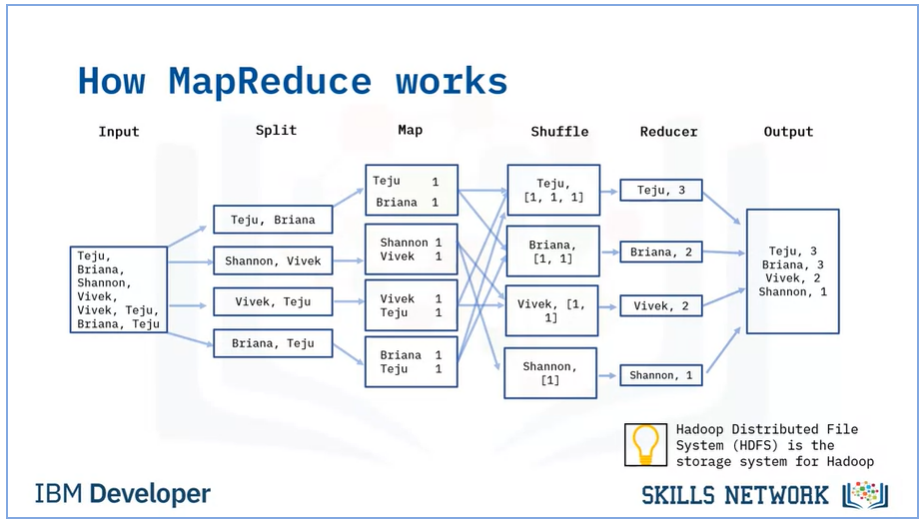
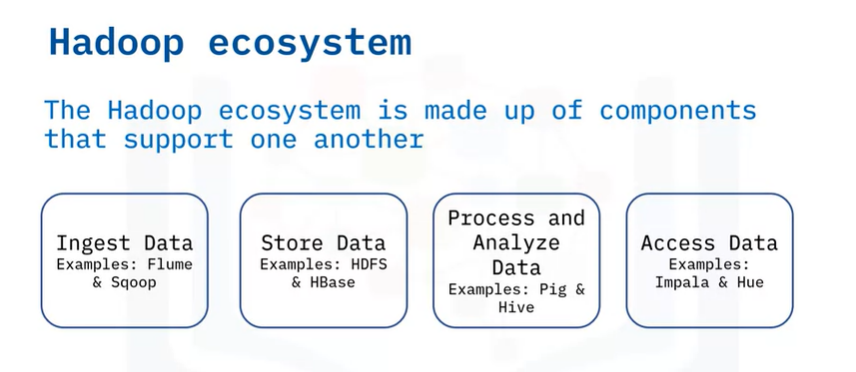
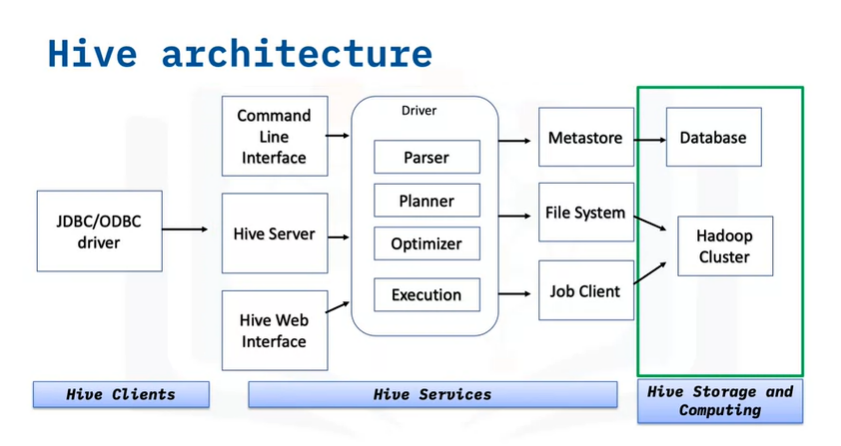
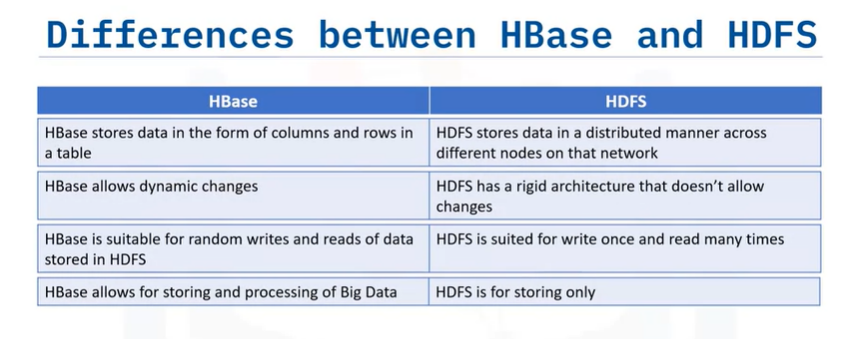
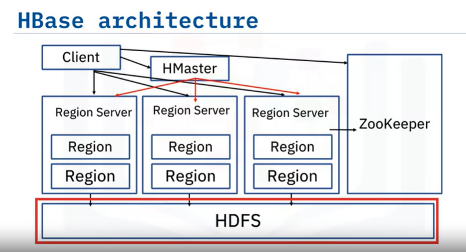
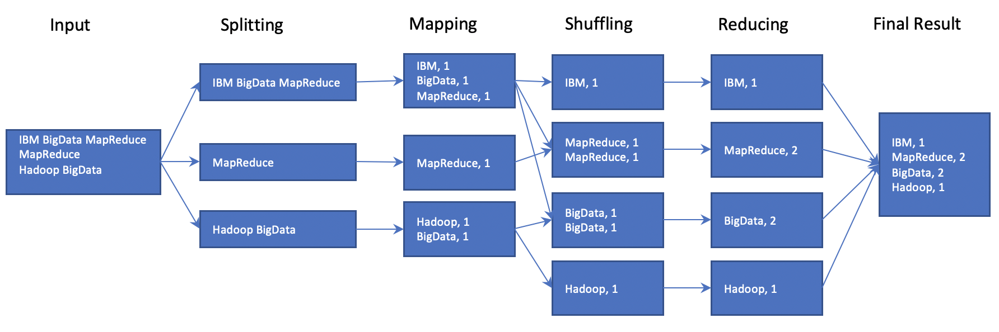
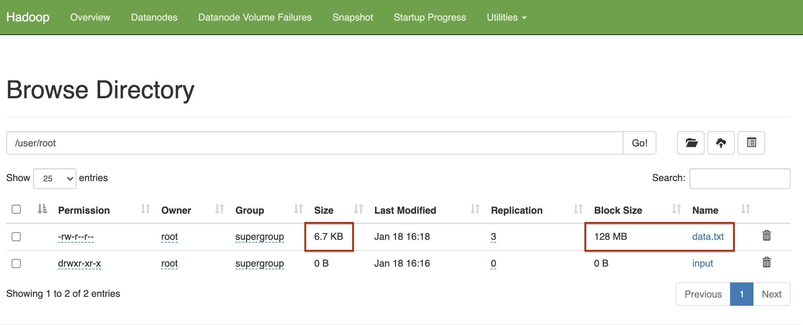
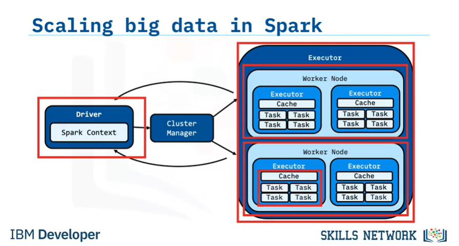

# Big Data with Spark & Hadoop

Notes from videos/labs. Mostly in Turkish.

## Content

1. [Week 1 - Introduction](#week-1---introduction)
2. [Week 2 - Hadoop](#week-2---hadoop)
3. [Week 3 - Spark](#week-3---spark)
4. [Week 4 - DataFrames & SparkSQL](#week-4---dataframes--sparksql)

## Week 1 - Introduction

1. [What is Big Data](#big-data-nedir)
2. [5V of Big Data](#5-v-of-big-data)
3. [Impact of Big Data](#impact-of-big-data)
4. [Parallel Processiong & Scalability](#parallel-processing--scalability)
5. [Tools and Ecosystem](#tools-and-ecosystem)
6. [Open Source and Big Data](#beyond-the-hype)
7. [Beyond the Hype](#beyond-the-hype)

### Big Data Nedir

* Veri buyuklugu normal verilere gore buyuk. 
* Structured, semi-structured veya unstuctured olabilir.
* Inceleyebilmek icin process edilmesi gerekli.
* Farkli kaynaklardan surekli olarak akis halinde gelir.
* Videolar, ses, resim gibi turlerde de olabilir.
* Daginik sistemlerde islenirler.

Su akisa gore ilerlenir:

1. Data Collection (Hadoop Hdfs)
2. Data Modelling (Hadoop Yarn / MapReduce)
3. Data Processing (Spark, Hive)
4. Data Visualization

### 5 V of Big Data

* Velocity: Hizli islenme, durmadan islenme. Batch, gercek zamana yakin ve streaming olarak islenebilir.
* Volume: Datanin miktari. Surekli artiyor.
* Variety: Veri makinalardan, insanlardan ve islemlerden gelebilir. Structured, semi str. veya unstr. olabilir.
* Veracity: Veri kalitesi, kaynagi ve tutarliligiyla ilgilidir. Insanlardan ve islemlerden gelen veriyle ilgilidir.
* Value: Hepsinden alinabilecek value.

### Impact of Big Data

Alisveris sitelerinde, kisisel asistanlarda sikca kullanilir. Amazon, Siri, Google Now gibi gibi.

IoT cok data uretiyor bu konuda.

### Parallel Processing & Scalability

Parallel processing:
Veri buyuk oldugu icin klasik bilgisayar metodu kullanilamiyor. Veriyi diskten al, memory'e, isle, geri yukle yapamiyorsun boyuttan oturu.

Veriyle yapilacak tum islemleri farkli konumlarda cozmeye calisiyorsun, boylece hata durumunda ayni node icinde o islem tekrar yapiliyor. 

Data Scaling nedir?

Verinin boyutuna gore memory'i veya bilgisayari buyuttugunu dusun. OKey ama Big Data icin no no.

Onun yerine Horizontal Scale yapiyosun, embarrasingly parallel yapacaksin. Bisuru node veya cluster olacak veriyi paylastirabilecek.

Bunda da soyle durumlar oluyor: Veriyi siralayacaksin mesela buyukten kucuge. Node'lar birbiriyle iletisime gece gece tek makina gibi hareket etmek zorunda kalacak.

O yuzden, boyle toplu islemleri yapmak icin bi node'un olacak. Verinin ilgili kisimlarini burada tutacaksin tek parca. Verinin kopyalarini da node'lara dagitacaksin.

### Tools and Ecosystem

- [Data Tech](#data-tech)
- [Analytics and Visualization](#analytics-and-visualization)
- [Business Intelligence](#business-intelligence)
- [Cloud Providers](#cloud)
- [NoSql Dbs](#nosql-databases)
- [Programming Tools](#programming-tools)

#### Data Tech

- Hadoop
- HDFS
- Spark
- MapReduce
- Cloudera
- DataBricks

#### Analytics and Visualization

- Tableau
- Palantir
- SAS
- Pentaho
- Teradata

#### Business Intelligence

Raw Data'yi kullanilabilir hale getirir, analize uygun hale getirir. Istatistik gibi alanlari kullanabilir.

- Cognos
- Oracle
- Power BI
- Business Objects
- Hyperion

#### Cloud

- AWS
- IBM
- Google Cloud
- Oracle

#### NoSQL Databases

- MongoDB
- CouchDB
- Cassandra
- Redis

#### Programming Tools

- R
- Python
- SQL
- Scala
- Julia

### Open Source and Big Data

Projelerin gelistirilmesi ve surdurulmesi icin kacinilmaz. 

Commiter: Kodu dogrudan degistirebilenler.
Contributer: Degisiklikleri review icin gonderen destekciler.
User: Kullanicilar.

Hadoop kritik bi Big Data teknolojisi. Hadoop'taki su projeler mesela onemli open source:

- MapReduce, Spark'in muadili
- Hadoop File System, Dataset manager gibi
- Yet Another Resource Negatioator (YARN), Resource Manager. Kubernetes gibi muadilleri var.

Hive ve Spark, ETL islerini filan destekliyor hep.

### Beyond the Hype

Big Data Kaynaklari:

- Social Data
- Machine Data (IoT vs.)
- Transactional Data

**Structured Data:**

Organized, labeled ve tablo seklinde formati var.

Sql direkt bir ornek.

**Unstructured data:**

Image'lar, sensor datasi, text data vs. vs.

Sosyal medya icerikleri filan buralardaymis. Videolar vs.

**Semi Structured**

E postalar mesela. Hem structured alanlar var hem de karisik alanlar.

Xml veya Json dosyalari da buraya giriyor

Cloud computing'in ilerlemesi de big datayi hizlandirmis.

### Use Cases

Finans, teknoloji ve telekomunikasyon'da cok kullanim var. Retail, government ve healthcare devam ediyor.

**Retail'de** mesela:

- Price Analytics
- Sentiment Analystics: Urunler hakkindaki yorumlardan cikarim yapar

 **Insurance:**

- Fraud Analytics
- Risk Assessment: user history'e gore modelleme yapilabilir.

**Telecommunications:**

- Network Security
- Location Bases Promotions
- Real time network analytics
- Pricing promotions

**Manufacturing:**

- Predictive Maintenance
- Production Optimization

**Automative:**

- Predictive Support: bunun arabasi bozulacak arayalim bi
- Connected self-driven cars

**Finance:**

- CUstomer Segmentation
- Algoritmic Trading

## Week 2 - Hadoop

1. [Introduction](#hadoop-introduction)
2. [MapReduce](#mapreduce)
3. [Hadoop Ecosystem](#hadoop-ecosystem)
4. [HDFS](#hdfs)
5. [HIVE](#hive)
6. [HBase](#hbase)
7. [Hadoop and MapReduce Lab Example](#hadoop--mapreduce-lab-example)
8. [Hadoop Cluster Lab Example](#hadoop-cluster-example-lab)

### Hadoop Introduction

Big data teknolojisi.
Buyuk miktarda data, farkli farkli kaynaklardan gelen data ve structured & unstr. data icin ideal. Cluster'larda paralel calisabilir.

Bir DB Degil, data isleme ortami gibi.

* HDFS : Storage module. 
* MapReduce: Processing unit.
* YARN: Resource manager.

Kotu yanlari:

- Transaction processing
- Parallel degil de lineer isler
- Datada dependency varsa
- Low latency data access
- Cok sayida kucuk dosya varsa (MapReduce'un bazi ozellikleri bunun icin gelistirildi)
- Little data uzerinde Intensive calculations (Hive daha iyi)

### MapReduce

Big Data isleyicisi. Hadoop'un kalbi. Distrubuted computing saglar. Map ve Reduce tasklarindan olusur (tabi ki).

Map: Input file alir (hdfs'ten mesela), bilgileri key-value listesi olarak map halinde saklar. Bikac islem daha yapar.

Reducer'a iletilir. Reduce de paralel sekilde derliyor topluyor isliyor.

**Isleyisi:**

'isimler' datasinda kac tane ozgun isim oldugunu bulan akis:



**Neden MapReduce Kullanalim?**

- Parallel Computing saglar node'lar arasinda. Name ve Data Node'lari olur Hadoop'ta
- Splitting and running tasks in parallel

**Use Case'ler**

- Sosyal medya uygulamalari
- Recommendations data
- Financial Industries
- Advertisements (cok severiz malum)

### Hadoop Ecosystem

Hadoop Common - Common utilities and other modules. Orn:

- HDFS
- MapReduce
- YARN



**Ingesting:**

- Flume: Big Data toplar ve iletir. Basit ve esnek bir mimarisi vardir
- Sqoop: Relational Db datasi toplar ve hadoop'a iletir. Ayrica ilgili MapReduce kodlarini da olusturup uretiyormus. Hdfs islerini de hallediyor sanirim(?). Db accessi oldugu icin schema'lari anliyor.

**Store data:**

- HBase: Column based sekilde non-relational databasedir. Hdfs uzerinde calisir. Datayi hashmapler, yani indexler, halinde saklayip random access-faster access saglar.
- Cassandra: Bir NoSQL db'dir.

**Analyzing data:**

- Pig: Large data analyzer. Prosedurel data flow language'i var.
- Hive: Report creating. Server side calisir. Kullanici erismek istedigi datayi secer: declerative'dir.

**Access data:**

- Impala: Non-tech userlarin kullanimini saglar.
- Hue: Hadoop User Experience'in kisaltmasi. Data upload, browse ve query islemleri saglar. Pig islerini ve akislarini calistirabilir. Hive ve MySql icin SQL query destegi saglar.

### HDFS

Buyuk datayi bloklar halinde replike ederek saklar. Fault tolerant da oluyormus boylece. Scale etmesi de kolay ve ucuz.

Streaming data access'i sunuyormus.

Ayrica bir CLI sunuyormus interaksiyon icin.

**Blocklar** calisiyor. 64 mb veya 128 mb chunklar halinde tutuyor blocklari. Daha az kalirsa bi bloga, daha az olabilir tabi.

Block is a minumum size of a file (dolmayabilir)

**Nodes**

Calisan her bi makina gibi dusunelim. Primary ve Secondary Node'lar var.

- **Primary Node:** aka. Name Node. File access'i duzenler. Secondary node'un tasklarini yonetir. Her CLUSTER'da 1 tane.

- **Secondary Node:** aka. Data Node. Read Write requestlerini gerceklestirir. Cokca olabilir.

Primary node, is ustlendigi zaman kendisine en yakin rack'leri onceliklendirir. Maximizing efficiency.

**Racks**

Rack: 40 veya 50 adet, ayni networku kullanan node toplulugu

Rack awareness calisiyor Hadoop. Onceliklendirme yaptigi gibi, ayrica replikasyon yapilan rack'leri de farkli tutuyor ki fault proof devam.

**Boyuta gore siralama:**

Blocks -> Nodes -> Racks -> Cluster

**Replication demisken:**

Backup amaclidir. Replication factor: Bir block'un kac kere replike edilecegi.

#### Write once, read many times

HDFS'in dosya konsepti. Editing updatingden ziyade append usulu.

**Read** icin: Client datanin oldugu node'u bulmak icin istek atar. Read requestini ilgili node'a atar(?). Close connection.

**Write** icin: Yazdirilmak istenen file var mi diye bakilir. Varsa IO Exception. Yoksa yetkilendirilir. Yazma islemi, replikalarin yazilmasiyla sonlanir.

### HIVE

Structured/Tabular data icin **warehouse software**. Read/write/manage islerini yapabiliyor. SQL gibi HiveQL'i var. Cleansing ve filtering destekliyor

**RDBMS'le kiyaslanisi:**


**Mimarisi:**



- JDBC/ODBC Client: Java applerini / ODBC applerini Hive'a baglayan clientlar.

- Hive Services:
    - Hive Server: Enabling Queries
    - Driver: Recieves query statements
    - Optimizer: Tasklari boler
    - Executor: Optimizer'dan aldigi tasklari calistirir
    - Metastore: Metadata storage

### HBase

Column base non-relational **bir database.** HDFS uzerinde calisir. Real time data ve random read/write access of Big Data islerinde iyiymis.

**Features:**

- Linearly & modularly scalable
- MapReduce isleri icin bir backup support
- Consistent reads and writes
- No fixed column schema
- Kullanici erisimi icin kolay bir Java API'i
- *Cluster'lar arasi* data replikasyonu da saglar

Column diyoruz da bildigin column iste. Ama kolonlari tek tek degil, bazilarini column family olarak grupluyor. Family'lere sonradan kolon eklenebiliyor. 

HBase'in de primary node / region server olarak iki nodu cesidi var.

**HBase ve HDFS Kiyaslamasi**

HBase dinamik degisikliklere izin veriyor, burasi onemli. Sadece write/read degil.



#### HBase Mimarisi:



- HMaster: Master Server.
    - Region serverlari monitor eder
    - Region serverlara region atar
    - Schemalara yapilan degisiklikleri yonetir
- Region Servers:
    - Read Write requestleri alir.
    - Regionlari yonetirler
    - Client ile direkt kontakt kurabilir.
- Region:
    - En kucuk HBase cluster birimi
    - Contains multiple stores. Her column family icin bir store.
    - HFile ve MemStore diye iki componenti varmis :(
- Zookeeper:
    - Node'lar arasi baglari maintain eder (hdfs diye nodelar var)
    - Daginiklikta senkronizasyon saglar
    - Server failure'lari tespit eder, islemleri yapar.

### Hadoop & MapReduce Lab Example

*Bu ve sonraki lablarda, 
hadoop ortamini windows'ta kurmakta sorunlar yasadim.
labaratuvar uzerinden ilerledim sadece*

Indirilen dosyalari, onceden olusturulmus bir 'wordCounter' mapReduce ile calistirdik.
Sonuc olarak bize bi *_SUCCESS* dosyasi, bi de *part-r-00000* dosyasi olustu.
Part-r olanda word count vardi.

Su komut ile programi calistirdik:

```sh
bin/hadoop jar share/hadoop/mapreduce/hadoop-mapreduce-examples-3.2.3.jar wordcount data.txt output
```

Ornegin calisma akisi su sekilde:



### Hadoop Cluster Example Lab

Dockerize hadoop kullanip hadoop Cluster yaratacagiz.

Indirilen git reposunda su komutla docker calistirildi:

```sh
docker-compose up -d
```

Docker-compose, bi YAML dosyasi icindeki servisleri olusturup calistirir.
Calistirinca soyle oldu:

```
 ⠿ Network ooxwv-docker_hadoop_default                Created   0.2s
 ⠿ Volume "ooxwv-docker_hadoop_hadoop_namenode"       Created   0.0s
 ⠿ Volume "ooxwv-docker_hadoop_hadoop_datanode"       Created   0.0s
 ⠿ Volume "ooxwv-docker_hadoop_hadoop_historyserver"  Created   0.0s
 ⠿ Container namenode                                 Started   5.3s
 ⠿ Container resourcemanager                          Started   3.0s
 ⠿ Container nodemanager                              Started   4.4s
 ⠿ Container datanode                                 Started   5.3s
 ⠿ Container historyserver                            Started   3.5s
 ```

Sonra asagidaki komutla nameNode'u calistirmisiz:

```
docker exec -it namenode /bin/bash
```

Hadoop'u kullanmak icin config dosyalari editleniyor. Bu dosyalardan bazisi:

- hadoop-env.sh: Masterfile. Yarn, hdfs, mapreduce ve hadoop ayarlarini ayarlar.
- core-site.xml: Hdfs ve Hadoop core ozelliklerini ayarlar.
- hdfs-site.xml: Node metadatasinin lokasyonunu, fsimage dosyasini ve log dosyasini kontrol eder.
- mapred-site.xml: MapReduce config parametreleri
- yarn-site.xml: Yarn ayarlari. Node manager, resource manager, containerlar ve Application master ayarlari vardir.

Hdfs icinde bir **directory yarattik**:

    hdfs dfs -mkdir -p /user/root/input

Hadoop config xml dosyalarini input klasorune kopyaladik:

    hdfs dfs -put $HADOOP_HOME/etc/hadoop/*.xml /user/root/input

data.txt dosyasi cektik internetten. Onu da */user/root* a kopyaladik:

    hdfs dfs -put data.txt /user/root/

*cat* ile dosya icerigine baktik, kopyaladigimizi teyit ettik:

    hdfs dfs -cat /user/root/data.txt

Bu noktada, calisan hadoop uygulamasina girecektik.
Ama kurstaki uygulama icinden calistiramadim aplikasyonu.
Gorsellere bakarak devam ediyorum.

Utilities -> Browse file system ile ilerlendiginde,
az once yarattigimiz dosyalari gorebiliyoruz.
data.txt dosyasini ve block sizelerini da goruyoruz:



Dosyaya tikladigimizda, block id'sini filan da gorebiliyoruz.

**Notlar:**

- Name Node, sakladigi dosyalarin metadatasini memory'de tutar. 
Quick access icin.
- Hadoop cluster'imizda sunlar olacak:
    - Name node
    - Data node
    - Node manager
    - Resource manager
    - Hadoop History Server

## Week 3 - Spark

1. [Introduction](#introduction-to-spark)
2. [Functional Programming Basics](#functional-programming-basics)
3. [Parallel Programming Using RDD](#parallel-programming-using-rdd)
4. [Parallelism in Spark and Scaling Out](#sparkta-parallelism-ve-scaling-out)
5. [SparkSQL and DataFrames](#sparksql-ve-dataframes)
6. [Spark Lab Example](#spark-labaratuvar)
7. [Spark Highlights](#week-3-spark-highlights)

### Introduction to Spark

Onemli ozellikler:

- Open source
- In-memory
- Distributed data processing
- Iterative analysis on Massive data
- Genelde Scala'da yazilir. Scala JVM'de calisir.

**Distributed != Parallel**

- Parallel: Farkli processorler, ayni memory
- Distributed: Processorlerin kendi memoryleri olabilir, daginik memoryler olabilir.

**Distributed'in faydalari:**

- Scalability ve modular growth
- Fault tolerance and redundancy

**MapReduce'a kiyaslanisi:**

MapReduce isinde diske veya HDFS'e yapilan read'ler write'lar olurdu.

Spark bunu gerekli datayi in-memory yaparak cozuyor.
Disk IO'lari expensive ve time consuming imis.

Data Engineering icin kullanilan Spark urunleri:

- Core Spark Engine
- Clusters and executors
- Cluster Management
- SparkSQL
- Catalyst Tungsten DataFrames

### Functional Programming Basics

- Matematiksel fonksyonlari temel alir
- Declarative model izler
- 'Nasil' odakli degil de 'ne' odaklidir. Input ve output odaklidir.
- Statementlar yerine expressionlar kullanir

Ayrica tasklarimizi node node ayirip parallelization da yapabiliriz(?).
Spark, inheritly parallel.

### Parallel Programming using RDD

**RDD:** Resillient Distributed Datasets.

- Spark'in temel data abstraction metodu.
- Fault tolerant collection of elements.
- Cluster icindeki node'lara partition'lanir.
- Parallel operasyonlari calistirabilir.
- **Immutable'dir**. Olustuktan sonra degistirilemez. Degistirilmesi teklif dahi edilemez.

Spark'ta bir 'driver program' calisir. 
Kullanicinin temel islemlerini gerceklestirir.
Parallel operasyonlari da cluster'lara uygular.

RDD supports file types:

- Text
- SequenceFiles
- Avro
- Parquer
- Hadoop input formats

RDD Supports file formats:

- Local
- Cassandra
- HBase
- HDFS
- Amazon S3
- SQL and NoSql

**RDD Olusturma**

External veya local file'i, Hadoop-Supported systemlerden alip olusturabiliriz.

HDFS, Hbase, S3 veya Cassandra RDD yaratimi icin yardimci olabilir.

**VEYA**

Kodumuzdaki collection'lardan da basitce olusturabiliriz.

```scala
val data = Array(1,2,3,4,5)
val distData = sc.parallelize(data)
```

Aha da RDD olusturduk driver-programdeki listeden. Python veya java'dan da yapabilirdik.

Dosyayi RDD'lestirmek konusunda, partitioning giriyor isin icine.
Kac partition olacak? Spark her partition icin 1 task calistirir.

Her CPU'ya 4 5 partition genelde okey.
Spark cluster'a gore otomatik sayida partition olusturur.
Biz manuel de verebiliriz.

**VEYA**

Mevcut bir RDD'yi modifiye edip de yeni bir RDD olusturabiliriz (cunku immutable)

#### Parallel Programming:

Cok sayida islem gucunun es zamanli kullanilip, computational problem cozmesi. Distributed gibi.

Runs simultaneous instructions on multiple processors.

Memory shared olarak kullanilir, distributed'den farkli olarak.

Control/coordination mekanizmasi kurar.

**RDD ile iliskisi**

RDD olustururken partitioning ile bolmustuk datayi.
Her partition worker'larda memory'de tutulur. 
Spark, cluster'daki *her partition icin bir task calistirir*.

**Nasil Resillience sagliyor?**

- Immutable oluslari **always recoverable** yapiyor datayi.
- **Persist & Cache** islemleri ile memory'de iterative isleri hizlandirir ve fault-tolerance saglar. (?)

### Spark'ta parallelism ve Scaling out

Spark'in 3 temel componenti:

- Data Storage: HDFS veya baska formatlar.
- Compute Interface: API'lar: Scala/Java/Python
- Management: Distributed isleri yonetir. Clusterlari filan. Mesos, YARN, Kubernetes vs.

**Spark Core:**

Base engine'dir. Ozellikleri:

- Fault tolerant
- Large scale parallel ve distributed data processing
- Manages memory
- Schedules tasks
- Houses API's that defines RDD's
- Contains distributed collection of elements that are oarakkekized across the cluster

**Spark'in nasil scale oldugu** de soyle aciklanmis:

- Driver Node
- Executor Node

Bu iki node arasinda patron/calisan iliskisi var.

Driver node tasklari yonetip distributed olarak pay eder.
Executor'de de *Worker Node*lar bu pay edilmis isleri ustlenip sonuclari geri Driver'a iletirler. Resimli olarak:



Bu Worker Node'lari artir dur istedigin kadar. Spark is gucu olarak onlara dagitsin isleri. Bu sayede big dataya scale ediliyor.

### SparkSQL ve DataFrames


#### SparkSQL

- **Structured** data processing modulu.
- Query icin SQL veya baska DataFrame API'lari kullanabilir.
- Java, Scala, Python ve R'da kullanilabilir.
- Kullanilan programlama dilinden veya API'lardan *bagimsiz* olarak SQL querylerini import edilen data uzerinde veya RDD uzerinde calistirir.

```py
results = spark.sql(
    "SELECT * FROM people")
# people'i onceki satirlarda register etmen gerekiyormus
names = results.map(lambda p: p.name)
```

**SparkSQL Faydalari**

- Cost-based optimizer'i, columnar storage'i, code generation'u var.
Bunlar fast query times demek.
- Spark Engine ile buyuk sayilara scale ettigi icin fault-tolerance.
- DataFrame abstractionunu sunar. Ayrica distributed SQL query engine olarak da calisir.

#### DataFrames

Python DataFrame'ine benziyor ama zengin optimizasyonlusu. Aslinda RDBMS Tablolarina benziyor.

RDD API'si uzerine kurulmustur. RDD'leri relational query atabilmek icin kullanir.

Python uzerinde json -> DataFrame olusturulmasi:

```py
df = spark.red.json('people.json')
df.show()
df.printSchema()

# Register the dataframe as temp SQL view.
df.createTempView('people')
# Artik tablo gibi kullanabiliriz people'i.
```

- DF'ler epey scalable'dir.
- Cokca data formatina ve storage system'e destegi var
- Optimizasyonu ve code generation'u gucludur (SQL Catalyst optimizer)
- Big data toollari ve infrastructure'lari ile Spark sayesinde erisilebilir.
- Python, Java, Scala ve R'da API'lari mevcut.

**DataFrame kullanimiyla SparkSQL'i kiyaslayalim:**

SparkSQL:

```py
spark.sql("SELECT age, name FROM people WHERE age > 21").show()
```

DataFrame Python API

```py
df.filter(df["age"]>21).show()
```

Ikisi de tablo olarak sonuc dondurecektir.

### Spark Labaratuvar

Spark normalde Scala uzerinde yazilmis. 
Python'dan PySpark kullanabiliriz tabi, ama bu python'un JVM'e erismesi demek.
JVM'e git geller kodu yavaslatabiliyor.
Buna istisna olarak SparkSQL'i gosterebiliriz, cunku query'leri precompile ediyor. Execution planning engine'i guclu.

Bu PySpark yavasligini minimuma indirgemek icin:

- 'Out of the box' metotlari agirlikli kullanmak lazimmis. Ne demekse...
- Spark metotlarina iterative/frequent call spamlamamak lazim.

Performans isteyen Scala'ya gitsin.

---

SparkContext ve SparkSession yaratilacak.
Sonrasinda RDD olusturulacak ve temel aksiyonlar denenecek.

**SparkContext**, Spark'in giris noktasidir. RDD yaratimi icin kullanilan fonksyonlari icerir. **parallelize()** gibi.

**SparkSession**, SparkSQL ve DataFrame operasyonlari icin gereklidir.

Session'u baslattiktan sonra sira RDD'lerde.
**RDD**ler Spark'in ilkel data soyutlama bicimidir. Fonksyonel programlamadan konseptler kullanarak olusturup manipule edecegiz.

Lab'da **parallelize()** kullanarak RDD olusturuluyor.

#### Lazy Evaluation & Transformations

RDD'ler Immutable demistik. Bu yuzden RDD'lerde islem yapacaksan (map, filter gibi) yeni RDD'ler olusturarak yapiyorsun.

Spark, bu transformation'lari RDD olustururken yapmiyor. 
RDD'ye ilistiriyor bu islemleri. Sen sonuclari cagiracak oldugunda aksiyonlar aliniyor. Sonuclari Driver'a cagirip doner.
Buna **Lazy Evaluation** denir.

Transformation'u cagirmak icin **collect()** cagrilir.

#### Caching

Bi RDD'yi **.cache()** ile cache'lersen, onda yapacagi ilk islemde cache'e de aktarim yapar.
Ayni islemi tekrar cagiracak ol mesela, hopp artik kisa surede yapacak.

#### DataFrames ve SparkSQL

SparkSQL'le calisabilmek icin Spark Session gerekli. Labin basinda kontrol ettik hemen.

**read.json()** ile basitce DF'e aktarabiliriz json dosyalayini.

DataFrame'leri SQL icin temp view'lara donusturebiliriz.
Bu sayede query icinde *FROM* alanina ekleyebiliriz.

Kodda SQL queryleri ile de sonuclari cekebiliriz,
DataFrame'in kendi metotlarini da kullanabiliriz.

#### Orneklere notlar:

**Q2 -** TempView yarattim soru icin. 
Ama komutu tekrar calistiracagimda ayni tempView mevcut diye hata veriyor.

Silip tekrar yukleyebilmek icin: **spark.catalog.dropTempView(...)** metodunu cagirdim.

**Q3 -** Spark Session'u kapatmamizi istemis.

Spark Session'larini hep kapatmak lazim best practice icin.
Resource paylastirma isleri icin lazim genelde.

Pekiii, **context'i kapatmali miyiz?**

Gerekli  degil. Yenisini yaratacaksan kapatman lazim mevcut olani. Onun disinda kalsin.

**SparkContext ile SparkSession farklari nedir?**

Aslinda ilk SparkContext yaratiliyor. Sonra SparkSession olusturuldugunda pek cok utility buraya aliniyor.

Su an, RDD yaratimi icin **SparkContext** (variable'i genelde **sc**),

Kalan islere de **SparkSession** (variable'i genelde **spark**) kullandim gibi.

### Week 3 Spark Highlights

Spark is an open source in-memory application framework for distributed data processing and iterative analysis on massive data volumes​. Both distributed systems and Apache Spark are inherently scalable and fault tolerant. ​Apache Spark solves the problems encountered with MapReduce by keeping a substantial portion of the data required in-memory, avoiding expensive and time-consuming disk I/O.​

Functional programming follows a declarative programming model that emphasizes “what” instead of “how to” and uses expressions.​

Lambda functions or operators are anonymous functions that enable functional programming​. Spark parallelizes computations using the lambda calculus​ and all functional Spark programs are inherently parallel​.

Resilient distributed datasets, or RDDs, are Spark’s primary data abstraction​ consisting of a fault-tolerant collection of elements partitioned across the nodes of the cluster, ​capable of accepting parallel operations​.​You can create an RDD using an external or local Hadoop-supported file, from a collection, or from another RDD. RDDs are immutable and always recoverable, providing resilience in Apache Spark​ RDDs can persist or cache datasets in memory across operations, which speeds iterative operations​ in Spark.

Apache Spark architecture consists of components data, compute input, and management​. The fault-tolerant Spark Core base engine performs large-scale Big Data worthy parallel and distributed data processing jobs, manages memory, schedules tasks, and houses APIs that define RDDs​.

Spark SQL provides a programming abstraction called DataFrames and can also act as a distributed SQL query engine​. Spark DataFrames are conceptually equivalent to a table in a relational database or a data frame in R/Python, but with richer optimizations​.

## Week 4 - DataFrames & SparkSQL

