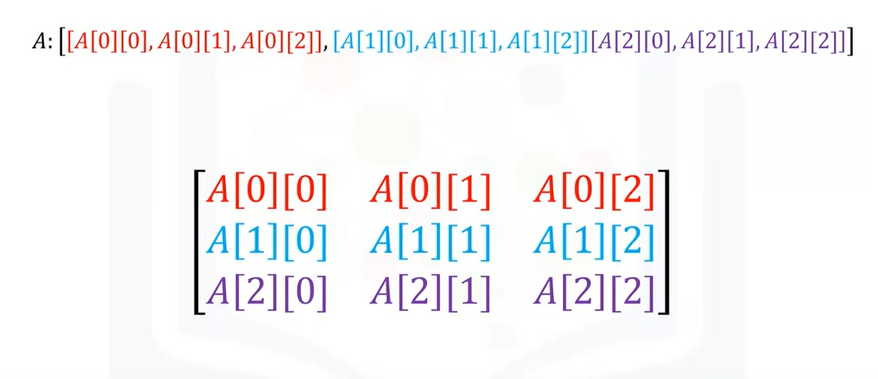

# Python Notes
(in Turkish, mostly)

## Table of Contents

1. [Intro](#intro)
2. [Lists](#lists)
3. [Strings](#strings)
4. [Tuples](#tuples)
5. [Lists](#list)
6. [Dictionaries](#dictionaries)
7. [Sets](#sets)
8. [Conditioning](#conditioning)
9. [Logic Operators](#logic-operators)
10. [Loops](#loops)
11. [Functions](#functions)
12. [Exception Handling](#exception-handling)
13. [Objects and Classes](#objects--classes)
14. [IO Operations](#io-operations)
15. [Pandas](#pandas)
16. [Numpy](#numpy)
17. [APIs](#apis)

## Intro
Type öğrenme fonskyonu: **type()**

### Typecasting 

```py
    float(1) : 1.0
    int(3.99) : 3  (asagi yuvarliyor fix)
    int('1') : 1
```

### Booleans 

Booleanların başı uppercase

**True / False**

```py
    bool(0) = False
```

### Divisions

**/** = float division

**//** = integer division.

25 / 5 : 5.0

### Kullandigim metodlar:

```py
Print('string')

sys.version (import sys lazim)
```

*#Comments*

sys.float_info  : float hakkinda teknik bilgiler

## Lists

Listelerde negative indexing var.
Son elemana 

```py
List[-1] diyerek ulasabilirsin
```

Listelerde ayni type aranmaz.
Farkli type nesneler ayni listede durabilir

Tuple'lar: ('A', 2) mesela.
Listeye bunlar bile girebiliyor, nested listler de girebiliyor.

```py
liste[4:9] // dersen indexi 4 9 arasi degerleri slice eder (ilk dahil ikinci degil)

.extend() // listeye eleman ekleme fonksyonu. 
list.extend(  [ 1 , 'C' ]  )  : 2 eleman ekledik
```

O sondaki listeyi tek bi eleman olarak eklemek istiyorsan da:

    
```py
append metodunu kullanacaksin. append( [array] ) yapaceksin.
```

Eleman degistirme:

```py
a[0] = 'Hoppp yeni deger';
```

Eleman silme:

```py
del(a[1])
```

## Strings

```py
string.split() # bize stringi KELIME KELIME split eder
```

Delimeter de alabilir tabi. split(,) dersin, virgule gore split eder

Referanslar javadaki gibi.
Ayni degeri gosteren referanslardan birini degistirirsen,
Diger referansin degeri de ayni seyi gosterdigi icin degisecek.

O yuzden, listeleri referanslarla degistirmek yerine klonlayabiliriz.

```py
B = A[:] diyorsun, hoppaa
```

Listeleri concat etmek (yazdirirken filan) icin + operatoru

```py
A = [ asdasd ]
B = [ Ikincil Degerler ]
A + B : [ adsasd, Ikincil Degerler ]
```

Tek tırnak veya cıft tırnak
Stringler array gibi kullanilabiliyor.

```py
String[0]   = stringin ilk karakteri
String[-1]  = stringin son harfi. Dogal olarak, negatif index de gecerli 
```

```py
Array[::2] demek, her 2nin modu eleman demek.
    
    string = "Bir String" olsun
    string[::2} = [BrSrn] donecek
```

Sayi yazmadan : koymak = 0 yazmak.
**string[0:5:2]** olsaydi **= [BrS]**

**string[5:6]** dersen!!!
5\. indexe git, 6. indexe kadar al demek (sadece 5)

**6 uzunlukta bisey al degil!** *(Tekrar baktim ve onayliyorum)*

```py
len(string) # uzunlugu verir
```

Concat, arraylardeki gibi **( + )** operatoru ile yapilir.

Stringleri Carpip Multiple edebiliriz.
    
```py
String * 3 = "Bir StringBir StringBir String" olurdu
```

Stringler immutable, java gibi.

```py
String[0] = "C"  diyemezsin
```

Onun yerine referansi yeni bi stringe point et

Escape Character: **\\**

- \n = new line
- \t = tab
- \\\ = backslash

    text = r"\nayir \nolamaz"    
    print(text) : "\nayir \nolamaz"

Bu bastaki **r**, escape'leri onluyor

### Bazi string metodlari:

```py
string.upper() = uppercase halini dondurur
string.replace("Degisecek kelime", "yeni kelime");
string.find("sub") = stringin icinde "sub" kelimesi kacinci indexte basliyor. 
                    Yoksa -1
```

## Tuples:

Sirali dizilerdir.
*(1,5,4,6,10,9)* boyle olur mesela. Sayilarin sirali olmasi sart degil

Bi tuple'da farkli typelar olabilir.
Ama tuple'in kendi type'i var **(tuple)**

Yine indexlerle erisim.

```py
Tuple[0] = ilk eleman. Negatif index de var yine
```

Concat yine **+** ile.
Slice yine var **tuple[1:3]** gibi.
**len()** de var
append ve extend **yok**!

```py
sorted(tuple) ile sortlayabiliriz
```

Stringdeki find() yerine burada **.index( item )** var

**TUPLE'LAR IMMUTABLE**.
Listler degil.
Degistirilemedigi icin,
Ayni seyi gosteren iki referanstan biri degisirse,
Digeri **degismiyor**.
String de boyle immutabledir.

```py
bisey = sorted( tuple ) ile sortlayabiliriz
```
Ama dondurulen type List olur! 
**[1,2,3]** olur elinde.

## List 

anam babam array.
Koseli parantez reis:

```py
[0:5]
```

**+** operatoru liste concat eder.

Listeler **mutable** olduğundan ilk elemanı son elemanı vs. Değiştirebiliriz.

```py
del(index) yaparak silebiliriz listeden.
```

String'deki **split()**, liste donduruyordu.
Delimeter de verebilirsin icine, ona gore boler

Mutable oldugu icin,
Ayni objeyi refere eden iki referanstan birini degistirirsen,
**Digeri de degisir!**

Listede degismesin istiyosan, ayni objeyi refer ettirmeyeceksin de,
**Klonlayacaksin** arrayi. B = A [ : ] Şeklinde

Tuple ile List concat edilemiyor lol denedim.

## Dictionaries

Map yahu

**Key ve Value**'ler var.
Key'ler **Immutable** olmali. **Unique** de olacak.
Her keyin yanina  **( : )**  ile value eklenir.
Yani keylerin tipi ayni olmak zorunda degil ama Immut. ve Uniq. Olmasi yeterli.

Touple bi keyle beraber string keyler kullanabiliriz, mesela:

```py
{ "key1":"value1", "key2":2, "key3":[3,3,3], ("Ouuu", "Bu bi touple keyi"):("Touple valuesu") }
Dict1[ "key1" ]  cagirirsan "value1" donecek.
```

{ } Sunlarla olusturduk

```py
Dict1 = {  biseyler:biseyler }
```

Eklemek icin olmayan bi degeri set et direkt.

```py
Dict1["za"] = "xd"
```

```py
del( Dict1[ "silinenKey" ] ) # ile degeri sildik

"Aranan Deger" in Dict1      # ile arama yaptik. 
# False donecek olmadigi icin, bool donuyor.

Dict1.keys( )   # cagirirsan keyler donecek, liste olarak
Dict1.values( ) # ile valuelari getirdik liste olarak
```

Ayni keyi iki kere kullanirsan:

```py
dic1 = { "key1":"a", "key1":"b" }
"key1":"b" # dondurur
```

## Sets

**Sirasiz, unique** elementler koleksyonu / KUMELER 

```py
Set1 = { "element" , "BaskaElement", 4 }
```

```py
set( list ) seklinde bi typeCast metodu da var.
List alip set cikariyor
```

```py
Set1.add ( "element" ) ile ekleme
Set1.remove ( "element" ) ile silme
"Aranan Deger" in Set1  ==  False donecek, in var yine Dict. gibi
```

Kumelerin kesisen degerini cekmek icin filan hep operatorler var.

- & Kesisen degerleri getirir. Set1 & Set2 yaparak ortak olan elementleri cektin.
- Kesisim icin ayrica Set1.intersection( Set2 ) de diyebilirdik
- Set1.union( Set2 ) diyerek de union yaptik, tum elemanlar geldi.
- Set1.difference( Set2 ) diyerek 1'de olup 2'de olmayanlari gorduk
- Set3.issubset( Set1 ) demek, Set3, Set1'in Subset'i mi diye bakiyor, bool return.
- Set3.issuperset( Set1 ) diyerek de, tam tersi iliskiyi kontrol.

Variable olusturmaya da gerek yok tabi, pratik iki ornek:

```py
set({ "A", "b" }).issubset( Set1 )
Set1.issuperset({ "Back in Black", "AC/DC" })
```

## Conditioning

Bool donen operatorlerimiz var.

```py
== equals kontrol eder
>   buyuktur   |||   >=  buyuk esittir
<   kucuktur   |||   <=   kucuk esittir
```

Char ve stringlerde ascii degere gore comparison var.

```py
'B' > 'A'  dir mesela.
'BA' > 'AB'  dir ayrica, ilkin onceligi var.
# (Ascii kodlari case sensitive)
```

```py
!=  esit degil

if (  condition  ) :
    Statement
elif (  other condition  ) :
    Other Statement
else :
    Otherest Statement
Continues
```

if indent'leri genelde 4 space (compiler based)

## Logic Operators

Bool alip bool donerler

```py
not( someBool ) # returns Bool'un Tersi
```

**or** 

```py
if( biseyler ) or ( baska seyler ):
    Bambaska seyler
```

**and**

```py
if( biseyler ) and ( baska seyler):
    Super seyler
```

Parantez sart degil.

```py
if biseyler or baskaSeyler or bambaskaSeyler:
    Statementz
```

## Loops

**range ( N )** metodu, (N pozitifse),
0'dan N'e kadar **range objesi** donuyor.

```py
range(3) = [0,1,2]
```

range( S, E ) Start S, End E arasi sequence

```py
range(10,13) = [10,11,12]
```

```py
for i in range( 0, 5 ) :
    array[i] = bisey
```

! Indent'e dikkat

loop'a range fonksyonu haricinde direkt List filan da verebilirsin

```py
for square in squares:
    Statements
```

Hem itemleri hem de indexlerini tutarak loop edebilirsin,

```py
for i, item in  enumerate ( squares ):
    print( i +"th element is: " + item )
```

**while** icin:

```py
i = 0
while ( array[i] > 5 and i<len(array) ):
    array.append(biseyler)
    i = i + 1  # i += 1 de olur
```

While'a **i < len(a)** ekledik, eklemezsek array out of bounds olana kadar dolasabilir

## Functions

Input alip output veren unsurlardir.

```py
def functionName(inputs):
    """ Documentation """
    # someTasks;
    return value;
```

Bazi tanimli fonksyonlar

```py
len(x)      ## x'in uzunlugunu getirir
sum(x)      ## iterable bir x'in degerlerini toplar
sorted(x)   ## Listeyi veya tuple'in sirali versiyonunu doner. 
            ## Orijinale bisey olmuyor.
sort(x)     ## mevcut listeyi siralar, degistirir
help(func)  ## func metodunun documentationunu getirir
```

Su referanstan bakilabilir bazi onemli olanlara:
[Python Onemli Metotlar](https://cf-courses-data.s3.us.cloud-object-storage.appdomain.cloud/IBMDeveloperSkillsNetwork-PY0101EN-SkillsNetwork/labs/Module%203/Python_reference_sheet.pdf?utm_term=10006555)

Type belirtilmedigi icin, overloada gerek olmuyor.

```py
def func(x,y):
    c = x * y
    return c

func(2,"string ")   : "string string "
func(3,5.6)         : 16.8
func(2,3)           : 6
```
**pass** keywordu metodlari return value olmadan gecebilmeni saglar. Aslinda **None** objesi donuyor.

```py
def func():
    pass

print(func()) : None
```

**Collecting Arguments**

Inputa kac sayida arguman gelecegini kestiremiyorsun, **\*** atiyosun basa. Metod onlari tuple'a ekliyor.

```py
def func(*names):
    for name in names:
        print(name)
```

Cift yildiz atarak, Tuple yerine **Dictionary** icine de toplayabiliriz. Ornekte inputun nasil verildigine dikkat!

```py
def printDictionary(**args):
    for key in args:
        print(key + " : " + args[key])

printDictionary(Country='Canada',Province='Ontario',City='Toronto')
# OUTPUT:
# Country : Canada
# Province : Ontario
# City : Toronto
```

Key:Value seklinde ( **:** ) isaretiyle verince calismiyor.

**Scope** 

Scope isleri gecerli halen. Metodda tanimladigin degeri baska yerde cagiramazsin.

Metodun disinda tanimladigin degeri metodda cagirabilirsin! Static gibi. Ama ayni isimde baska bisey tanimlamayacaksin local variable olarak.

Local variable'larin baslarina **global** yazarak, metodlarin disindan da erisilebilir olmalarini saglayabiliriz.

```py
def func()
    global z
    z = "deger"
    return z

func()      # Cagirdik ki o bloga girip olustursun
print(z)    # func'u cagirmasaydik gormezdi. 
```

**Default Arguements**

```py
def func(x=5):
    return x*x

print(func()) # returns 25
```

Tanimli referansi silmek icin

```py
del referans
```

Metoda input olarak gelen objeyi **dogrudan degistirebiliriz**. Ekstra anotasyonlara gerek olmuyor.

## Exception Handling

Dillerdeki exceptionlar bunlarda da var. Built-in exceptionlar listesi: [Exceptionlar](https://docs.python.org/3/library/exceptions.html)

### Try/Except/Else/Finally

Kullanim:

```py
try:
    x = 1/0
    print(x)
except (ZeroDivisionError, NameError):
    print("Tatsiz olaylar yasandi")
except IOError:
    print("Baska tatsiz olaylar da yasanabilirdi")
except:
    print("Kalan tum tatsizliklari burada topladim")
else:
    print("Tatsiz olaylar yasanmadi")
finally:
    print("Aman tadimiz kacmasin")
```

**Input alma yontemi**
```py
b = int(input("Please enter a number"))
# int'e typecast de var
```

## Objects & Classes

int'ler floatlar stringler listler dictionaryler filan hep bir type idi.
Her objenin bir type'i vardir. Instance(Object)ler type/classlardan olusur.

```py
class Student(object):
# class keyword
# Student class adi
# object, PARENT class

    def __init__(self, age, name="defaultName"):
    # init, ozel Constructor keywordudur
        self.age = age;
        self.name = name;
        #this.age = age gibi
```

```py
alperen = Student(25,'alperen')
# 'new' yok, self de onemli degil
print(alperen.age) # 25
alperen.age = 26
print(alperen.age) # 26 happy birthday
```

Metod ekleyelim

```py
def growOlder(self,years):
# self'i parametre olarak verdik, boylece:
# hangi instance'i update edecegimiz belli oldu
    self.age += years;
    return age # opsiyonel

alperen.growOlder(9)
print(alperen.age) # Otuzbes years old
```

```py
dir(instance)
#instance'in ait oldugu classin Attributelarini
# ve metodlarini getirir
```

## IO Operations

### Read File

Read islemi icin "r" modunda open metodu calistirilir.
Write icin "w", append icin "a" yazabilirdik. Baska baska modlar da var.

```py
file1 = open("/resources/fileToRead.txt","r")
# open( name , mode)
file1.close() # Bu Close ile ugrasacagina, with kullan:

# Sondaki column'u unutma
with open("Example1.txt","r") as File2:
    file_stuff=File2.read()
    print(file_stuff) 
print(File2.closed) # true dondurecek
print(file_stuff) 
```

Read metodlari:

```py
File2.read()      # Tum dosyayi string olarak aktarir
File2.read(x)     # x kadar karakter oku
File2.readlines() # Satirlarin oldugu bir liste verir.
File2.readline()  # Mevcut/ilk satiri okur
                  # Tekrar cagirirsan diger satira atlar.
File2.readline(x) # mevcut satirda x kadar oku, x satirdan
                  # daha uzun olursa asagi devam etmez.
```

File objesi iterable ve line'lari donecek. Boylece:

```py
with open("file","r") as File3:
    for line in File3:
        print(line)
```

Tum dosyada x kadar karakter oku demek icin:
```py
File2.readline(4) # Mevcut cursor/start'tan 4 karakter oku.
                  # Cursoru 5. karaktere set eder.
File2.readline(9) # 5. karakterden devam, 9 karakter okur.
```

### Write to a File

```py
file1 = open("path/file.txt","w") # "w" bu sefer
# OR
with open("path/file.txt","w") as file1:
    file1.write("Yazdirilan Satirlar\n")
    file1.write("Yazdirilan ikinci satir\n")
```
Bir listede stringlerimiz olsaydi, for loopu icinde her eleman icin write(eleman) yazdirabilirdik.

**"w"** modu ayni dosyayi tekrar cagirdiginda sifirlayip bastan yazacaktir.

Oyle olmamasi icin **"a"** modunda **append** ederek yazmamiz gerek. Bir takim modlar surada:

*   **r+** : Reading and writing. Cannot truncate the file.
*   **w+** : Writing and reading. Truncates the file.
*   **a+** : Appending and Reading. Creates a new file, if none exists.

Modlar devreye girdiginde, cursor'un pozisyonu onem kazaniyor.
**w, r ve a** straight forward baya. w ve r basta, a sonda cursor pozisyonu ile calisiyor.

**+** operatorler devreye girdiginde olay degisik.

```py
file1.tell()    # Cursorun pozisyonunu getirir.
file1.seek(0,0) # Cursoru 0 + 0. indexe gotur.
```

**a+** ile acildiginda cursor sonda bulundugu icin, kafana gore .read() atamiyorsun. Sondan okumaya calisacak.
Yukaridaki metodlar ile basa veya yazdirdigin yerlere dondurup yazabilirsin.

### Notlar

- r+ w+ a+ gibi modlarda cursor cok onemli. **truncate()** veya **print()** gibi fonksyonlarin islenisini cok bozuyor. Dosyayi sileyim de temiz dosyayla devam edeyim diyorsun, cursor sondaysa hicbir sey silmiyor mesela(?). 
- file1.**writelines( list )** metodu, inputtaki listenin her elemanini ayri ayri satirlara yazdirabiliyor.

```py
inactive = [member for member in members if ('no' in member)]
            '''
            The above is the same as 

            for member in members:
            if 'no' in member:
                inactive.append(member)
            '''
```

## Pandas

### Loading Data with Pandas

```py
import pandas as pd # kisaltma kullandik
csv_path = "file.csv"
df = pd.read_csv(csv_path) # df = dataFrame icin
df.head() # Ilk 5 rowu gostermesi icin komut
```
DataFrame, tabloya karsilik geliyor. Dictionarylerden de olusturabilirsin. Dictionarylerden:
```py
Dict = { 'Kolon1' : ['Kolondaki', 'Degerler', 'Sirayla'  ],
         'Kolon2' : ['Ikinci'   , 'Kolonun' , 'Degerleri']}
tablo_frame = pd.DataFrame(Dict)
```
Seklinde olusturabilirsin.

Baska Framelerin columnlarini araklayip yeni frame olusturmak da mumkun.

```py
frame = pd.read(biseyler)
impostor = frame[ ["Columnlari", "buraya", "sirala"] ] # dersen bu columnlardan frame olusturur.
# Columndaki degerleri de alir tabi yaninda
```

DataFramedeki degerlere **erismek** icin:

```py
df.ix[0,0] # ilk column ilk row cell degeri.
df[['ColumnAdi']] # Dogru mu emin degilim! Series getiriyor olabilir
# Dogruysa: O kolonu getirir, birden cok olabilir.
df[5] # 5. row
```

### Working with Pandas

Framedeki unique degerleri listelemeni saglayan bir fonksiyonu var.

```py
df['Column'].unique()

# ReleaseDate'i 1980den buyuk olan kayitlar
df[ df[ 'ReleaseDate'] >= 1980 ]
```

DataFrame'i dosyaya kaydetme:
```py
df1.to_csv("FileName.csv")
```

### Lab Notlari

DataFrame haricinde, **Series** Kullanimi da Pandas ile mevcut.
Series, tek boyutlu bir array gibi. Bi, veriyi iceren array var; bir de indexleri veya labellari tutan bir array. Map gibi yani. Ama, faydali bisuru metodu da varmis. **Sirali** ayrica.

Tek [ ] ile cagirirsan **Series** olarak cagirir. [[ ]] ile cagirirsan **DataFrame**

#### loc() ve iloc()
Bu metodlar ile Locate islemi yapilir.

- **loc[r,c]** label ile arama saglar.
- **iloc[r,c]** index ile arama saglar.

```py
df.loc[2,"Salary"] #2. rowdakinin Salarysi
df.iloc[0,0] #ilk row ilk column
```

```py
df.set_index("Salary") #Kolonu Index kolonu yapar.
df.index = list        # listedeki elemanlari tablonun yeni indexi yapar.
```

Index yaptigin kolon sayesinde, o kolondaki bi degeri df.loc[ **buraya**, 'yazabilirsin'].
Name indexken mesela:

```py
df1.loc['John', 'Salary'] #John'un paralari getir bi bakalim
```

! Pratik lazim loc iloc islerine

#### Slicing

```py
data[start:end] # end is excluded
[0:3]           # mesela 0 1 2
```

**loc()** kullaniminda start da end de **inclusive**. loc'un icine integer versen de boyle oluyor. Zaten loc'a verilen integer, pozisyonunu degil label'ini ifade ediyor.

```py
df.iloc[0:2, 0:3] # ilk 2 row, 3 column
```

### Ikinci Lab Notlari

iloc hep indexlere, loc da hep labellara(df'nin indexi de dahil) set edili unutma.

## Numpy

N Dimensional arrayler kullanmamizi saglar. Bu arrayler **ayni type**'da objeler iceren **sabit uzunluklu** objelerdir. Listelerden farki bu. 

Bazi propertyler:

```py
array.size  # array uzunlugu
array.ndim  # kac dimension oldugu
array.shape # her dimensionun size'i. Orn: (5,)
```

### Indexing & Slicing

Listelerdeki kullanimla ayni:

```py
a[0] = 100 # ilk elemani 100 yapar
```

Slicing icin:

```py
b = a[1:3]  # a'nin 1 ve 2. indexlerinden 
            # bir array olusutur.
a[3:5] = 300,400
# 3. ve 4. indexleri 300 ve 400 yaptik
a[1:8:2]    # mod 2'ye gore seciyo, ikiser ikiser
a[:4]       # start, default 0'dur
a[0:]       # end, belirtilmezse son elemandir & lengthtir
a[1:6:]     # step, belirtilmezse 1'dir ve her seyi yazdirir
```

### Matematik Islemleri

Numpy'in arrayleri toplama gibi bir operasyonu var.
Daha rahat anlasilmasi icin vektor toplami seklinde videoda ifade edilmis. Array olusuturup boyle toplamak, python listleri olusturup **zip()** metodu ile toplamaya calismaktan hem daha rahat hem daha hizli imis

```py
a = np.array([1,0])
b = np.array([0,1])
c = a + b  # [1,1]
    # Veya
c = np.add(a,b)
```

Cikarma da ayni sekilde mevcut. Skaler carpim da gecerli aynen (2 ile carpim gibi mesela).

Ikı vektorun birbiriyle carpiminda bi x product bi dot product vardi. Cross product kolay olan. Ilk degerler ilk degerlerle carpiliyor, ikinciler ikinci degerlerle...

Cross product:
```py
a * b # seklinde ifade ediliyor.
```

Dot product:
Ilk degerler carpimi + ikinci degerler carpimi
Iki vektorun ne kadar benzer oldugunu verir(?) dedi.

Numpy'da yapmak icin:
```py
result = np.dot(a,b)
```

Vektore skaler ekleme:

```py
c = a+1 # her degere 1 ekler
```

### Universal Functions

Tum dimensionlar icin gecerli fonskyonlardir:

```py
np.pi    # pi sayisinin constanti
a.mean() # tum elemanlarin ortalamasini dondurur
a.max()  # max degeri dondurur
a.sin()  # tum degerleri sin(x) fonskyonuna sokar. Cikti olarak baska bi array doner.
np.linspace(s,e,v)
# start: s ve end: e arasini, 
# v kadar value olacak sekilde
# ESIT ARALIKLARA bolup, 
# array olarak dondurur. Orn:
# np.linespace(-2,2,5) : -2 ve 2 arasindaki 
# tam sayilari dondurecektir array halinde
```

### Lab Notlari

```py
np.__version__  # version
a.dtype     # data type
a[list]     # index olarak liste verirsen,
        # listedeki elemanlarin oldugu
        # indexleri alir. Hatta:

list = [1,3,4,5,7]
a[list] = 1000  # list'deki degerlerin hepsi
            # 1000 oldu.

a.std()     # Standart Sapma/Deviation
```

Aritmetik islemler icin + - * gibi,

```py
np.add(a,b)      # +
np.subtract(a,b) # - || a'dan b'yi cikar
np.multiply      # * || Skaler carpim
np.divide        # / || a bolu b
np.dot           # dot product
```

### Two Dimensional Numpy

Ornek:

```py
a = [[1,2,3],[10,11,12],[700,800,900]]

a = |  1, 2 ,3  |
    | 10,11 ,12 |
    |700,800,900|

a.ndim  = 2
a.shape = (3,3) # 3 tane, 3 elemanli liste.
                # veya 3 x 3 bir matrix
a.size  = 9

a[0][0]     # ilk row ilk column
a[0,1]      # Aynisi
a[1][2]     # ikinci row ucuncu column
```


Slicing de mevcut

```py
a[0,0:2]  # ilk row, ilk iki eleman
          # np.ndarray objesi doner
```

One-Dimensional islemler burada da var:

```py
z = x + y   # Matrix Addition
z = 2 * x   # Skaler carpim
z = x * y   # cross product
z = np.dot(x,y)
# x'in row sayisi y'nin column sayisina esitse
# Internetten bak yaw bisuru aciklama var
np.sin(z)   # z'nin tum degerlerine sin() alir
z.T         # Transpose! (rowlar->columnlara cevrilir)
```

## APIs

Programlarin birbirleriyle etkilesmesini saglayan arayuzler. Bu iletisim metotlar tarafindan basitce yurutulebilir.

**REST APIs**: REpresentational State Transfer APIs. Web servisleriyle iletisimi saglar. HTTP kullanir. Json icerir. Request ve response mantigi.

Ornek olarak, PyCoinGecko apisini kullaniyor. Bilgisayara kurup, programa import edince, metodlari istedigin gibi cagir. Ornegin devaminda ibm text to speech ve translation apileri isledi biraz.

### Lab notlari

Ayni isin lab'i icin Api credentialleri indirdim. Speech to text ve Language Translator api'leri.

Authenticator ile credential ve url'i dogruladim. Ardindan servisi obje olarak cekip gerekli metodlarla speech to text islemleri yapildi. Ayni sekilde language translator de kullanildi.